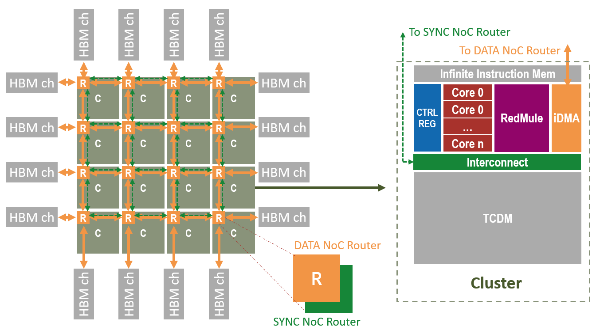

# SoftHier Simulation Model in GVSoC

## SoftHier Architecture Overview



## OS Requirements Installation

The following instructions are designed for a fresh installation of Ubuntu 22.04 (Jammy Jellyfish).

To install the required packages, run:

```bash
sudo apt-get install -y build-essential git doxygen python3-pip libsdl2-dev curl cmake gtkwave libsndfile1-dev rsync autoconf automake texinfo libtool pkg-config libsdl2-ttf-dev
```

## Toolchain Requirements

GVSoC requires the following tools and versions:

- **g++** and **gcc** versions >= 11.2.0
- **cmake** version >= 3.18.1
- **Python** version >= 3.8.3

Please ensure your toolchain meets these requirements. You can set the following environment variables as an example (adjust the versions as per your setup):

```bash
export CXX=g++-11.2.0
export CC=gcc-11.2.0
export CMAKE=cmake-3.18.1
```

## Getting Started with SoftHier Simulation

### Clone the Repository and Set Up the Environment

Follow these steps to set up the SoftHier simulation environment:

1. **Clone the repository** and navigate into the project directory:

   ```bash
   git clone https://github.com/gvsoc/gvsoc.git -b soft_hier_flex_cluster soft_hier
   cd soft_hier
   ```

2. **Set up the toolchain** by exporting the necessary environment variables (adjust the versions as needed):

   ```bash
   export CXX=g++-11.2.0
   export CC=gcc-11.2.0
   export CMAKE=cmake-3.18.1
   ```

3. **Initialize the simulator environment** by running:

   ```bash
   source softhier_pushbutton.sh
   ```

### Build and Run the SoftHier Simulation Model

1. **Build the SoftHier hardware model**:

   ```bash
   make build_softhier_hw
   ```

2. **Run the simulation** with an example binary:

   ```bash
   ./install/bin/gvsoc --target=pulp.chips.flex_cluster.flex_cluster --binary examples/SoftHier/binary/example.elf run --trace=/chip/cluster_0/redmule
   ```

   - `--binary`: Specifies the executable binary to be loaded for the SoftHier simulation.
   - `--trace`: Indicates which component's trace logs should be generated during the simulation.

### Build SoftHier Executable Binary

(Specific toolchain details for building SoftHier executable binaries will be provided soon.)


## SoftHier Simulation Tutorial

All SoftHier model source code can be found in the `soft_hier/flex_cluster/` directory. The software stack is located in the `soft_hier/flex_cluster_sdk/test` directory.

### SoftHier Architecture Configuration

The architecture configuration is managed through the Python file `soft_hier/flex_cluster/flex_cluster_arch.py`, which includes parameters such as:

- **Cluster Configuration**:
  - Number of clusters in the mesh (X and Y dimensions)
  - Number of Snitch (RISC-V) cores per cluster
  - TCDM (L1) banks: width and number

- **RedMule Configuration**:
  - Number of RedMule cores per cluster
  - CE array size (height and width)
  - CE pipeline stages
  - Element size (in bytes) for operations
  - RedMule access queue depth

- **DMA Configuration**:
  - Number of outstanding transactions
  - Burst length per transaction

- **HBM Configuration**:
  - Number of HBM channels per cluster (at edge)
  - HBM channel placement (West, North, East, South edges)

- **NoC Configuration**:
  - Number of outstanding transactions per router
  - NoC link data width

The file also contains detailed system address mappings.

Here is an example of the configuration:

```python
class FlexClusterArch:

    def __init__(self):

        #Cluster
        self.num_cluster_x           = 4
        self.num_cluster_y           = 4
        self.num_core_per_cluster    = 3

        self.cluster_tcdm_bank_width = 8
        self.cluster_tcdm_bank_nb    = 64

        self.cluster_tcdm_base       = 0x00000000
        self.cluster_tcdm_size       = 0x00100000
        self.cluster_tcdm_remote     = 0x30000000

        self.cluster_stack_base      = 0x10000000
        self.cluster_stack_size      = 0x00020000

        self.cluster_reg_base        = 0x20000000
        self.cluster_reg_size        = 0x00000200

        #RedMule
        self.num_redmule_per_cluster = 1
        self.redmule_ce_height       = 128
        self.redmule_ce_width        = 32
        self.redmule_ce_pipe         = 3
        self.redmule_elem_size       = 2
        self.redmule_queue_depth     = 1
        self.redmule_reg_base        = 0x20020000
        self.redmule_reg_size        = 0x00000200

        #IDMA
        self.idma_outstand_txn       = 16
        self.idma_outstand_burst     = 256

        #HBM
        self.hbm_start_base          = 0xc0000000
        self.hbm_node_interleave     = 0x00100000
        self.num_hbm_ch_per_node     = 1
        self.hbm_placement           = [4,0,0,4]

        #NoC
        self.noc_outstanding         = 64
        self.noc_link_width          = 512

        #System
        self.instruction_mem_base    = 0x80000000
        self.instruction_mem_size    = 0x00010000

        self.soc_register_base       = 0x90000000
        self.soc_register_size       = 0x00010000
        self.soc_register_eoc        = 0x90000000
        self.soc_register_wakeup     = 0x90000004

        #Synchronization
        self.sync_base               = 0x40000000
        self.sync_interleave         = 0x00000080
        self.sync_special_mem        = 0x00000040

```

### SoftHier Software

The entry point for programs on the SoftHier architecture is located in the file `soft_hier/flex_cluster_sdk/test/src/test.c`. By default, it runs an example of GEMM (General Matrix Multiply) using one cluster.

```C
#include "flex_runtime.h"
#include "kernels/gemm/gemm_systolic_wise.h"
#include "examples/example_one_cluster_gemm.h"
#include <math.h>

int main()
{
    uint32_t eoc_val = 0;
    flex_barrier_xy_init();
    flex_global_barrier_xy();
    flex_timer_start();
    /**************************************/
    /*  Program Execution Region -- Start */
    /**************************************/

    example_one_cluster_gemm();

    /**************************************/
    /*  Program Execution Region -- Stop  */
    /**************************************/
    flex_global_barrier_xy();
    flex_timer_end();
    flex_eoc(eoc_val);
	return 0;
}
```
The function of example_one_cluster_gemm is defined in file `soft_hier/flex_cluster_sdk/test/include/examples/example_one_cluster_gemm.h`. The code demonstrates how to:

1. Use DMA to transfer data between HBM and the cluster.
2. Use RedMule to accelerate GEMM operations.

```C
#ifndef _EXAMPLE_ONE_CLUSTER_GEMM_H_
#define _EXAMPLE_ONE_CLUSTER_GEMM_H_

#include <math.h>
#include "flex_runtime.h"
#include "flex_redmule.h"
#include "flex_cluster_arch.h"
#include "flex_dma_pattern.h"

// GEMM M-N-K           : 1024-1024-1024
// Elem Size            : Int16
// Assumption           : Data are already tiled in HBM

#define ELEM_SIZE      2
#define GEMM_DIMENSION 1024
#define GEMM_SIZE_BYTE (GEMM_DIMENSION * GEMM_DIMENSION * ELEM_SIZE)
#define TILE_DIMENSION 256
#define TILE_SIZE_BYTE (TILE_DIMENSION * TILE_DIMENSION * ELEM_SIZE)
#define TILES_PER_DIM  (GEMM_DIMENSION/TILE_DIMENSION)

#define X_HBM_OFFSET   0
#define W_HBM_OFFSET   (X_HBM_OFFSET + GEMM_SIZE_BYTE)
#define Y_HBM_OFFSET   (W_HBM_OFFSET + GEMM_SIZE_BYTE)
#define Z_HBM_OFFSET   (Y_HBM_OFFSET + GEMM_SIZE_BYTE)

#define X_L1_OFFSET1   0
#define W_L1_OFFSET1   (X_L1_OFFSET1 + TILE_SIZE_BYTE)
#define X_L1_OFFSET2   (W_L1_OFFSET1 + TILE_SIZE_BYTE)
#define W_L1_OFFSET2   (X_L1_OFFSET2 + TILE_SIZE_BYTE)
#define YZ_L1_OFFSET   (W_L1_OFFSET2 + TILE_SIZE_BYTE)

void example_one_cluster_gemm(){
    flex_global_barrier_xy();//Global barrier

    uint32_t CID = flex_get_cluster_id();//Get cluster ID

    //Initialize RedMule Paramters
    if (flex_is_first_core() && (CID == 0))//Use the first core in cluster 0 to configure RedMule
    {
        //Configure M-N-K of tile that RedMule will accelerate
        flex_redmule_config(TILE_DIMENSION, TILE_DIMENSION, TILE_DIMENSION);
    }

    flex_global_barrier_xy();//Global barrier

    if (CID == 0)//Only let Cluster 0 to work
    {
        //Iterate over every Z tiles
        for (int row = 0; row < TILES_PER_DIM; ++row)
        {
            for (int col = 0; col < TILES_PER_DIM; ++col)
            {
                //Start address of tiles
                uint32_t X_hbm_addr = X_HBM_OFFSET + row * TILES_PER_DIM * TILE_SIZE_BYTE;
                uint32_t W_hbm_addr = W_HBM_OFFSET + col * TILE_SIZE_BYTE;
                uint32_t Y_hbm_addr = Y_HBM_OFFSET + row * TILES_PER_DIM * TILE_SIZE_BYTE + col * TILE_SIZE_BYTE;
                uint32_t Z_hbm_addr = Z_HBM_OFFSET + row * TILES_PER_DIM * TILE_SIZE_BYTE + col * TILE_SIZE_BYTE;


                //Preload Y,X,W tiles
                if (flex_is_dm_core()){//Use DM core to trigger DMA transcations
                    //Trigger DMA transaction: move Y tile from HBM to L1
                    flex_dma_async_1d(local(YZ_L1_OFFSET),hbm_addr(Y_hbm_addr), TILE_SIZE_BYTE);

                    //Trigger DMA transaction: move X tile from HBM to L1
                    flex_dma_async_1d(local(X_L1_OFFSET1),hbm_addr(X_hbm_addr), TILE_SIZE_BYTE);

                    //Trigger DMA transaction: move W tile from HBM to L1
                    flex_dma_async_1d(local(W_L1_OFFSET1),hbm_addr(W_hbm_addr), TILE_SIZE_BYTE);

                    //Wait all DMA transaction done
                    flex_dma_async_wait_all();
                }
                flex_intra_cluster_sync();//Cluster barrier

                //Compute X and W to YZ in L1 + preload next X and W
                for (int i = 0; i < (TILES_PER_DIM-1); ++i)
                {
                    //Calculate next X and W tile address in HBM
                    X_hbm_addr += TILE_SIZE_BYTE;
                    W_hbm_addr += TILES_PER_DIM * TILE_SIZE_BYTE;

                    //Ping-Pong operations on Double-Buffering X and W
                    if (i%2 == 0)
                    {
                        if (flex_is_dm_core()){//Use DM core to trigger DMA transcations
                            //Trigger DMA transaction: move X tile from HBM to L1
                            flex_dma_async_1d(local(X_L1_OFFSET2),hbm_addr(X_hbm_addr), TILE_SIZE_BYTE);

                            //Trigger DMA transaction: move W tile from HBM to L1
                            flex_dma_async_1d(local(W_L1_OFFSET2),hbm_addr(W_hbm_addr), TILE_SIZE_BYTE);

                            //Wait all DMA transaction done
                            flex_dma_async_wait_all();
                        }

                        if (flex_is_first_core())//Use the first core in cluster 0 to configure and trigger RedMule
                        {
                            //Configure tile address in L1 and run RedMule acceleration
                            flex_redmule_trigger(X_L1_OFFSET1, W_L1_OFFSET1, YZ_L1_OFFSET);

                            //Wait RedMule Done
                            flex_redmule_wait();
                        }
                    } else {
                        if (flex_is_dm_core()){//Use DM core to trigger DMA transcations
                            //Trigger DMA transaction: move X tile from HBM to L1
                            flex_dma_async_1d(local(X_L1_OFFSET1),hbm_addr(X_hbm_addr), TILE_SIZE_BYTE);

                            //Trigger DMA transaction: move W tile from HBM to L1
                            flex_dma_async_1d(local(W_L1_OFFSET1),hbm_addr(W_hbm_addr), TILE_SIZE_BYTE);

                            //Wait all DMA transaction done
                            flex_dma_async_wait_all();
                        }

                        if (flex_is_first_core())//Use the first core in cluster 0 to configure and trigger RedMule
                        {
                            //Configure tile address in L1 and run RedMule acceleration
                            flex_redmule_trigger(X_L1_OFFSET2, W_L1_OFFSET2, YZ_L1_OFFSET);

                            //Wait RedMule Done
                            flex_redmule_wait();
                        }
                    }
                    flex_intra_cluster_sync();//Cluster barrier
                }

                //Last Computation
                if (flex_is_first_core())
                {
                    flex_redmule_trigger(X_L1_OFFSET2, W_L1_OFFSET2, YZ_L1_OFFSET);
                    flex_redmule_wait();
                }
                flex_intra_cluster_sync();//Cluster barrier

                //Store Z tile
                if (flex_is_dm_core()){
                    //Trigger DMA transaction: move Z tile from L1 to HBM
                    flex_dma_async_1d(hbm_addr(Z_hbm_addr),local(YZ_L1_OFFSET), TILE_SIZE_BYTE);

                    //Wait all DMA transaction done
                    flex_dma_async_wait_all();
                }
                flex_intra_cluster_sync();//Cluster barrier
            }
        }
    }

    flex_global_barrier_xy();//Global barrier

}


#endif
```
