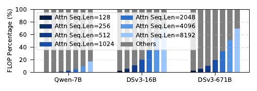
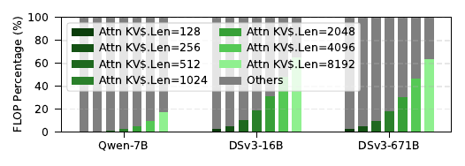
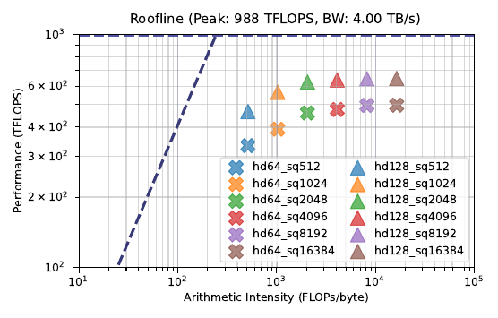
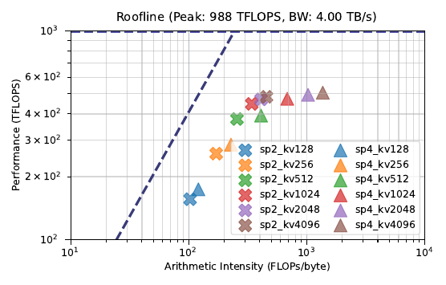

# Nvidia GH200 Benchmarking 
## FLOP breakdown

The following figures compare the floating-point operation breakdown of the attention mechanism and other computational kernels between the MHA+MLP model Qwen-chat-7B (*Qwen-7B*) and MLA+MoE models DeepSeek-v3-16B (*DSv3-16B*) and DeepSeek-v3-671B (*DSv3-671B*), during both the prefill and decode stages.
At long-context inference, the attention mechanism of *Qwen-7B* accounts for 19% of all floating-point operations, whereas in *DSv3-671B* this proportion increases to 71% during decoding, with a similar trend observed in the prefill stage.
 
FLOP breakdown for LLM models during prefill

 
FLOP breakdown for LLM models during decode stages.

## Roofline Plot
Benchmarking of prefill and decode performance on Nvidia GH200 GPU. Evaluated with FP16 precision, varying head dimension (hd) and sequence length (sq) for prefill, while varying speculative length (sp) and kv cache length (kv) for decoding.
The following figures show the performance of FlashAttention-3 during the prefill stage and FlashMLA during decoding on the GH200 roofline model. Both implementations exhibit a large performance gap relative to the roofline, ranging from 26% to 64%.
### FlashAttention prefill performance
 

### FlashMLA decode performance  
 