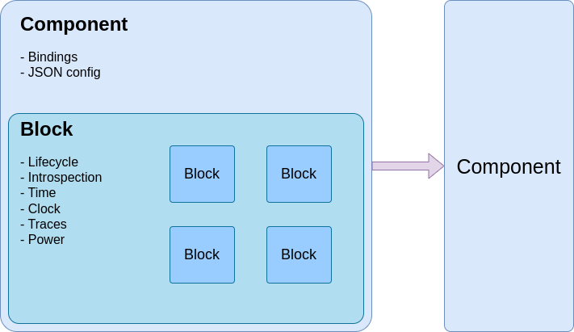
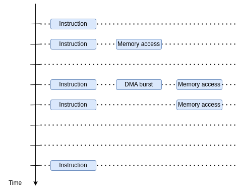
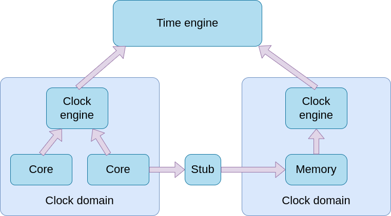
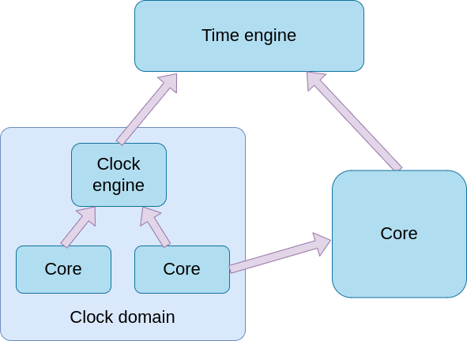

Block object
============

Overview
........

As seen on the following picture, components are mostly used to propagate JSON configuration from Python generators,
and to communicate with other components through bindings.

All the other features are provided by the *vp::Block* object, and each Component is inheriting from. It provides the following features:

- **Lifecycle**: A set of methods for managing the state of blocks like start, reset, stop and so on.
- **Introspection**: Get name parent and childs.
- **Time**: features for executing callbacks at specific timestamps.
- **Clock**: features for executing callbacks at specific cycles.
- **Traces**: features for dumping system traces, used for debugging models and simulated software.
- **Power**: features for modeling power consumption.

Contrary to components which are instantiated by Python generators, blocks can be instantiated by C++ models in
order to build a hierarchy of blocks.

Lifecycle methods
.................

Here is the list of lifecyle methods which can be overloaded by the model to implement actions at specific events:

.. code-block:: cpp

    virtual void reset(bool active) {}

    virtual void start() {}

    virtual void stop() {}

    virtual void flush() {}

    virtual void *external_bind(std::string path, std::string itf_name, void *handle);

    virtual std::string handle_command(gv::GvProxy *proxy, FILE *req_file, FILE *reply_file,
        std::vector<std::string> args, std::string req) { return ""; }

    virtual void power_supply_set(vp::PowerSupplyState state) {}

.. list-table:: Available port signature
   :header-rows: 1

   * - Name
     - Description
   * - reset
     - Called anytime the value of the reset is changed. Can be overloaded to do some
       initializations and trigger something when it is released.
   * - start
     - Called after the system has been instantiated and before the reset. Can be overloaded in
       order to interact with other components through ports, or to instantiate objects like
       threads which require the system to be instantiated.
   * - stop
     - Called when the simulation is over. Can be overloaded to close some objects like files.
   * - flush
     - Called anytime an interactive action happens like the profiler paused the simulation or
       a breakpoint was reached. Can be overloaded to make something visible to the user, like
       flushing stdout.
   * - external_bind
     - Called when an external loaded wants to be bound to an internal component.
   * - handle_command
     - Called when the GVSOC proxy needs this component to handle a custom command.
   * - power_supply_set
     - Called when the power supplied has changed. Can be overloaded to take some actions
       like changing power consumption.

Here is an example of a *start*, which is often used to start a thread once the whole system has been
instantiated:

.. code-block:: cpp

    void Gdb_server::start()
    {
        if (this->rsp)
        {
            this->rsp->start(this->get_js_config()->get_child_int("port"));
        }
    }

An example of *reset*, which is often used to clear everything when it is asserted, and to start something when
it is deasserted:

.. code-block:: cpp

    void Memory::reset(bool active)
    {
        if (active)
        {
            this->status.set(0);
        }
        else
        {
            this->notif_itf.sync(true);
        }
    }

Event-based modeling
....................

As seen on the next figure, the whole system simulation is based on event-based modeling.

The idea is that each model can be broken down into small callbacks, which gets executed at specific timestamps in order
to simulate the expected hardware behavior.

Clock model
...........

Overview
########

In order to ease the modeling of clock domains, models are most of the time clocked, so that they just have
to care about cycles.

For that, each fequency domain is organized around a clock engine. Each component of the clock domain is connected
to the clock engine and can interact with it in order to execute callbacks at spicific cycles.

The clock engine is then in charge of converting the cycles to timestamps according to the clock domain frequency
so that overall, they execute at the expected timestamp. This way, models do not have to worry about frequency changes.

Each clock engine interact with the global time engine to execute the callbacks at the right timestamp.

There are also stubs for bindings which are crossing frequency domains. The stubs are in charge of synchronizing the clock
engines, and to do cycle conversion.

Clock events
############

Clock events are used to enqueue callbacks to be executed at specific cycles.

They must be declared with class *vp::ClockEvent* and must be associated a callback which is a static
method of the class, like for ports.

.. code-block:: cpp

    class MyComp : public vp::Component
    {

    public:
        MyComp(vp::ComponentConf &config);

    private:
        static vp::IoReqStatus handle_request(vp::Block *__this, vp::IoReq *req);
        static void handle_event(vp::Block *_this, vp::ClockEvent *event);

        vp::ClockEvent event;
    };

Clock events must be configured with their callbacks:

.. code-block:: cpp

    MyComp::MyComp(vp::ComponentConf &config)
        : vp::Component(config), event(this, MyComp::handle_event)
    {
    }

They can be enqueue by giving the number of cycles after which they must be executed:

.. code-block:: cpp

    vp::IoReqStatus MyComp::handle_request(vp::Block *__this, vp::IoReq *req)
    {
        MyComp *_this = (MyComp *)__this;

        _this->queue.push(req)
        _this->event.enqueue(10);

        return vp::IO_REQ_PENDING;
    }

    void MyComp::handle_event(vp::Block *__this, vp::ClockEvent *event)
    {
        MyComp *_this = (MyComp *)__this;

        vp::IoReq *req = _this->queue.pop();
        req->get_resp_port()->resp(req);
    }

The clock engine will make sure the callback gets called at the right timestamp.

Clock events which are enqueued are executed only once.

It is also possible to enable them so that they execute at every cycle, which can be faster for some models
like the ISS:

.. code-block:: cpp

    void Exec::reset(bool active)
    {
        if (active)
        {
            this->instr_event->disable();
        }
        else
        {
            this->instr_event->enable();
        }
    }

In this case, it is still possible to skip some cycles, due to stall by calling this method:

.. code-block:: cpp

    inline void Timing::stall_cycles_account(int cycles)
    {
        this->iss.exec.instr_event->stall_cycle_inc(cycles);
    }

Here are all the methods available for clock events:

.. code-block:: cpp

        inline void set_callback(ClockEventMeth *meth);
        inline void **get_args();
        inline void exec();

        inline void enqueue(int64_t cycles = 1);
        inline void cancel();
        inline bool is_enqueued();

        inline void enable();
        inline void disable();
        inline void stall_cycle_set(int64_t value);
        inline void stall_cycle_inc(int64_t inc);
        inline int64_t stall_cycle_get();

Asynchronous blocks
...................

Overview
########

Some models do not have any clock and needs to enqueue callback execution at timestamps instead of cycles. Time events
can be used for such components.

In this case, there is no clock engine, and the component is enqueueing callbacks directly to the time engine.

Time events
###########

Time events are very similar to clock events except that they are enqueued with a timestamp.

They are declared the same way:

.. code-block:: cpp

    class MyComp : public vp::Component
    {

    public:
        MyComp(vp::ComponentConf &config);

    private:
        static void handle_event(vp::Block *_this, vp::TimeEvent *event);

        vp::TimeEvent event;
    };

.. code-block:: cpp

    MyComp::MyComp(vp::ComponentConf &config)
        : vp::Component(config), event(this, MyComp::handle_event)
    {
    }

The enqueue is very similar, the timestamp is given in picoseconds:

.. code-block:: cpp

    void Exec::reset(bool active)
    {
        if (!active)
        {
            this->event.enqueue(10000);
        }
    }

As for clock events, the event callback gets executed when the time engine reaches the event timestamp:

.. code-block:: cpp

    void MyComp::handle_event(vp::Block *__this, vp::ClockEvent *event)
    {
        MyComp *_this = (MyComp *)__this;
        _this->event.enqueue(10000);
    }

Here is the full list of methods for time events:

.. code-block:: cpp

        inline void set_callback(TimeEventMeth *meth);
        inline void **get_args();

        inline void enqueue(int64_t time);
        inline bool is_enqueued();
