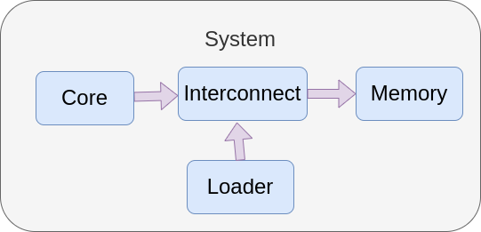

Component model
===============

High-level component model
..........................

Python generators
.................

Composites for building systems
###############################

.. code-block:: python

    import cpu.iss.riscv
    import memory.memory
    import vp.clock_domain 
    import interco.router
    import utils.loader.loader
    import gvsoc.systree
    import gvsoc.runner as gvsoc

    # Tell Gapy that this file describes a valid target
    GAPY_TARGET = True

    class Soc(gvsoc.systree.Component):

        def __init__(self, parent, name, parser):
            super().__init__(parent, name)

            # Parse the arguments to get the path to the binary to be loaded
            [args, __] = parser.parse_known_args()

            binary = args.binary

            # Main memory
            mem = memory.memory.Memory(self, 'mem', size=0x00100000)

            # Main interconnect
            ico = interco.router.Router(self, 'ico')
            # Add a mapping to the memory and connect it.
            ico.o_MAP(mem.i_INPUT(), 'mem', base=0x00000000, remove_offset=0x00000000, size=0x00100000)

            # Instantiates the main core and connect fetch and data to the interconnect
            host = cpu.iss.riscv.Riscv(self, 'host', isa='rv64imafdc')
            host.o_FETCH     (ico.i_INPUT    ())
            host.o_DATA      (ico.i_INPUT    ())

            # Finally connect an ELF loader, which will execute first and will then
            # send to the core the boot address and notify him he can start
            loader = utils.loader.loader.ElfLoader(self, 'loader', binary=binary)
            loader.o_OUT     (ico.i_INPUT    ())
            loader.o_START   (host.i_FETCHEN ())
            loader.o_ENTRY   (host.i_ENTRY   ())

    # This is a wrapping component of the real one in order to connect a clock generator to it
    # so that it automatically propagate to other components
    class Rv64(gvsoc.systree.Component):

        def __init__(self, parent, name, parser, options):

            super().__init__(parent, name, options=options)

            clock = vp.clock_domain.Clock_domain(self, 'clock', frequency=100000000)
            soc = Soc(self, 'soc', parser)
            clock.o_CLOCK    (soc.i_CLOCK    ())

    # This is the top target that gapy will instantiate
    class Target(gvsoc.Target):

        def __init__(self, parser, options):
            super(Target, self).__init__(parser, options,
                model=Rv64, description="RV64 virtual board")

Primitives for wrapping C++ models
##################################

.. code-block:: python

    import gvsoc.systree

    class Memory(gvsoc.systree.Component):
        """Memory array

        This models a simple memory model.
        It can be preloaded with initial data.
        It contains a timing model of a bandwidth, reported through latency.
        It can support riscv atomics.

        Attributes
        ----------
        parent: gvsoc.systree.Component
            The parent component where this one should be instantiated.
        name: str
            The name of the component within the parent space.
        size: int
            The size of the memory in bytes.
        width_log2: int
            The log2 of the bandwidth to the memory, i.e. the number of bytes it can transfer per cycle.
            No timing model is applied if it is zero and the memory is then having an infinite
            bandwidth.
        stim_file: str
            The path to a binary file which should be preloaded at beginning of the memory. The format
            is a raw binary, and is loaded with an fread.
        power_trigger: bool
            True if the memory should trigger power report generation based on dedicated accesses.
        align: int
            Specify a required alignment for the allocated memory used for the memory model.
        atomics: bool
            True if the memory should support riscv atomics. Since this is slowing down the model, it
            should be set to True only if needed.
        """
        def __init__(self, parent: gvsoc.systree.Component, name: str, size: int, width_log2: int=2,
                stim_file: str=None, power_trigger: bool=False,
                align: int=0, atomics: bool=False):

            super().__init__(parent, name)

            self.add_sources(['memory/memory.cpp'])

            # Since atomics are slowing down the model, this is better to compile the support only
            # if needed. Note that the framework will take care of compiling this model twice
            # if both memories with and without atomics are instantiated.
            if atomics:
                self.add_c_flags(['-DCONFIG_ATOMICS=1'])

            self.add_properties({
                'size': size,
                'stim_file': stim_file,
                'power_trigger': power_trigger,
                'width_bits': width_log2,
                'align': align
            })

        def i_INPUT(self) -> gvsoc.systree.SlaveItf:
            """Returns the input port.

            Incoming requests to be handled by the memory should be sent to this port.\n
            It instantiates a port of type vp::IoSlave.\n

            Returns
            ----------
            gvsoc.systree.SlaveItf
                The slave interface
            """
            return gvsoc.systree.SlaveItf(self, 'input', signature='io')

C++ component model
...................

Module constructor
##################

.. code-block:: cpp

    extern "C" vp::Component *gv_new(vp::ComponentConf &config)
    {
        return new Memory(config);
    }

Class declaration
#################

.. code-block:: cpp

    #include <vp/vp.hpp>

    class Memory : public vp::Component
    {

    public:
        Memory(vp::ComponentConf &config);
    };

.. code-block:: cpp

    #include <utils/composite.hpp>

    class Cluster : public vp::Composite
    {

    public:
        Cluster(vp::ComponentConf &config);
    };

Class constructor
#################

.. code-block:: cpp

    Memory::Memory(vp::ComponentConf &config)
        : vp::Component(config)
    {
    }

.. code-block:: cpp

    Cluster::Cluster(vp::ComponentConf &config)
        : vp::Composite(config)
    {
    }

Port declaration
################

.. code-block:: cpp

    class Memory : public vp::Component
    {

    public:
        Memory(vp::ComponentConf &config);

    private:
        static vp::IoReqStatus request_handler(vp::Block *__this, vp::IoReq *req);

        vp::IoSlave request_itf;

        vp::WireMaster<bool> notif_itf;
    };

.. code-block:: cpp

    Memory::Memory(vp::ComponentConf &config)
        : vp::Component(config)
    {
        this->request_itf.set_req_meth(&Memory::request_handler);

        this->new_slave_port("input", &this->request_itf);

        this->new_master_port("notif", &this->notif_itf);
    }

.. list-table:: Available port signature
   :header-rows: 1

   * - Name
     - Path in core module
     - Ports
   * - Clock domain registration
     - engine/include/vp/itf/clk.hpp
     - ClkMaster -> ClkSlave
   * - Clock configuration
     - engine/include/vp/itf/clock.hpp
     - ClockMaster -> ClockSlave
   * - Wire
     - engine/include/vp/itf/wire.hpp
     - WireMaster -> WireSlave
   * - Memory-mapped IO requests
     - engine/include/vp/itf/io.hpp
     - IoMaster -> IoSlave
   * - I2C
     - engine/include/vp/itf/i2c.hpp
     - I2cMaster -> I2cSlave
   * - JTAG
     - engine/include/vp/itf/jtag.hpp
     - JtagMaster -> JtagSlave
   * - I2S
     - engine/include/vp/itf/i2s.hpp
     - I2sMaster -> I2sSlave
   * - SPI
     - engine/include/vp/itf/qspim.hpp
     - QspimMaster -> QspimSlave
   * - Hyperbus
     - engine/include/vp/itf/hyper.hpp
     - HyperMaster -> HyperSlave
   * - CPI
     - engine/include/vp/itf/cpi.hpp
     - CpiMaster -> CpiSlave
   * - UART
     - engine/include/vp/itf/uart.hpp
     - UartMaster -> UartSlave

Port method call
################

.. code-block:: cpp

    void Memory::reset(bool active)
    {
        if (!active)
        {
            this->notif_itf.sync(true);
        }
    }

Component JSON configuration
############################

.. code-block:: python

    def __init__(self, parent: gvsoc.systree.Component, name: str, size: int, width_log2: int=2,
            stim_file: str=None, power_trigger: bool=False,
            align: int=0, atomics: bool=False):

        super().__init__(parent, name)

        self.add_properties({
            'size': size,
            'stim_file': stim_file,
            'power_trigger': power_trigger,
            'width_bits': width_log2,
            'align': align
        })

.. code-block:: json

    "mem": {
        "size": 1048576,
        "stim_file": null,
        "power_trigger": false,
        "width_bits": 2,
        "align": 0,
        "vp_component": "gen_memory_memory_cpp_149327240",
        "ports": [
          "input"
        ]
    }

.. code-block:: cpp

    Memory::Memory(vp::ComponentConf &config)
        : vp::Component(config)
    {
        js::Config *config = this->get_js_config();

        this->size = config->get_child_int("size");
    }

