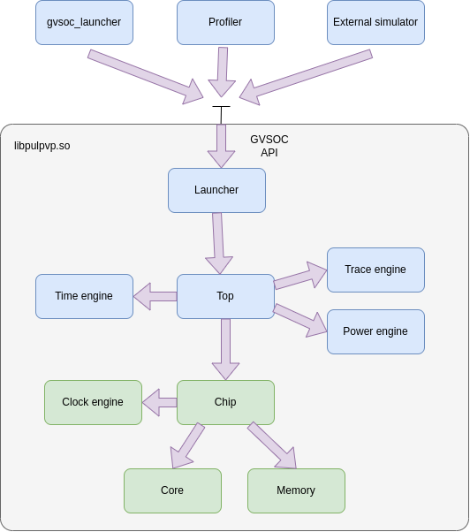
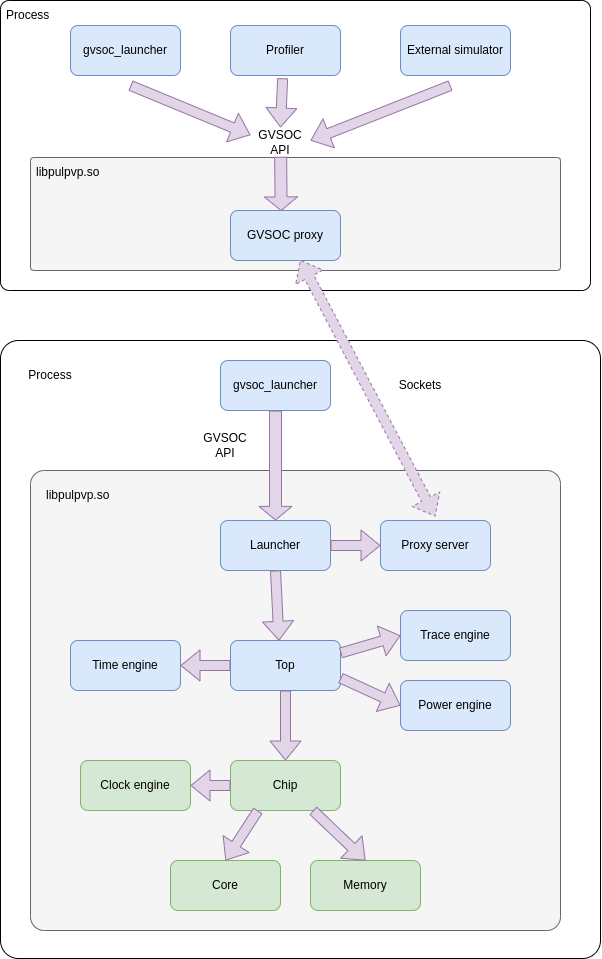

GVSOC architecture
==================

Overview
........

Here is an overview of the structure of GVSOC:

Compiling GVSOC is producing a shared library called *libpulpvp.so* which contains all the engine code
and will then take care of loading component code through other shared libraries.

This GVSOC library is then exporting its functionnalities through a C++ API called the GVSOC API.

This allows running GVSOC through several kind of tools.

The first is the gvsoc_launcher, which is the one run by default. This launcher is just a very simple main
which is using the GVSOC API to instantiate the system to be simulated and to ask GVSOC to run it until the end.

This gvsoc_launcher is launched from the command line with a single option, the path to the JSON configuration
of the system to be simulated. This JSON configuration is generated by the gvsoc command using the Python
generators and the gvsoc_launcher is just passing the path to the GVSOC library through the API.

This launcher can then be replaced by other tools. For example a profiler can take care of controlling
GVSOC through this API to run, pause and resume it, based on buttons in the GUI.

It is also possible to integrate GVSOC inside a bigger simulator, for example to integrate a GVSOC model
into a bigger SystemC simulator.

Inside the GVSOC library, the launcher module is in charge of implementing the API for the 2 available modes:

* In the asynchronous mode, the engine is running in a dedicated thread. Several threads are allowed
  to access the GVSOC API, which will interact with this thread to control the time engine execution.
  Other threads created by GVSOC are also allowed to lock the time engine in order to stop it so
  that they can interact with the models. This is used for example by the gdbserver to inject
  memory requests or to step the cores. This is also used by the proxy to inject commands sent through the
  CLI interface by for exemple an external Python script.
* In the synchronous mode, the engine is running from the thread calling the GVSOC API, when for example the
  thread is asking to run for some time. In this case, only one thread is allowed to call the API. If several threads
  must use the API, threads must synchronize together with mutexes to make sure only one is calling the API
  at the same time. In this mode, threads created by GVSOC can still lock the engine to interact with the
  models. The difference with asynchronous mode is that the locks may need to be handled by the external thread
  since the engine cannot handle locks when the API is not being called.

As seen on the example below, there is another mode where GVSOC is launched as a process with a proxy waiting
for commands coming from another process. Another process can then interact with it through the GVSOC API which is
forwarded to the GVSOC process through sockets. This mode can be useful for some tools where we still want to launch
GVSOC from the command line, but control it from a GUI running in a different process for isolation purpose.

Code organization
.................

| core/engine
| ├── CMakeLists.txt
| ├── include
| │   ├── gv
| │   │   ├── gvsoc.hpp
| │   │   └── testbench.hpp
| │   └── vp
| │       ├── block.hpp
| │       ├── component.hpp
| │       ├── jsmn.h
| │       ├── json.hpp
| │       ├── launcher.hpp
| │       ├── ports.hpp
| │       ├── proxy_client.hpp
| │       ├── proxy.hpp
| │       ├── queue.hpp
| │       ├── register.hpp
| │       ├── signal.hpp
| │       ├── top.hpp
| │       ├── vp.hpp
| │       ├── time
| │       │   ├── block_time.hpp
| │       │   ├── implementation.hpp
| │       │   ├── time_engine.hpp
| │       │   └── time_event.hpp
| │       ├── clock
| │       │   ├── block_clock.hpp
| │       │   ├── clock_engine.hpp
| │       │   ├── clock_event.hpp
| │       │   └── implementation.hpp
| │       ├── power
| │       │   ├── block_power.hpp
| │       │   ├── power.hpp
| │       │   ├── power_source.hpp
| │       │   ├── power_table.hpp
| │       │   └── power_trace.hpp
| │       ├── trace
| │       │   ├── block_trace.hpp
| │       │   ├── event_dumper.hpp
| │       │   ├── implementation.hpp
| │       │   ├── trace_engine.hpp
| │       │   └── trace.hpp
| │       ├── gdbserver
| │       │   └── gdbserver_engine.hpp
| │       └── itf
| │           ├── clk.hpp
| │           ├── clock.hpp
| │           ├── cpi.hpp
| │           ├── hyper.hpp
| │           ├── i2c.hpp
| │           ├── i2s.hpp
| │           ├── implem
| │           │   ├── clock_class.hpp
| │           │   ├── clock.hpp
| │           │   ├── wire_class.hpp
| │           │   └── wire.hpp
| │           ├── io.hpp
| │           ├── jtag.hpp
| │           ├── qspim.hpp
| │           ├── uart.hpp
| │           ├── wire.hpp
| │           └── wire.json
| └── src
|     ├── block.cpp
|     ├── component.cpp
|     ├── jsmn.cpp
|     ├── json.cpp
|     ├── launcher.cpp
|     ├── main.cpp
|     ├── main_systemc.cpp
|     ├── main_systemc.hpp
|     ├── ports.cpp
|     ├── proxy_client.cpp
|     ├── proxy.cpp
|     ├── queue.cpp
|     ├── register.cpp
|     ├── signal.cpp
|     ├── top.cpp
|     ├── time
|     │   ├── block_time.cpp
|     │   ├── time_engine.cpp
|     │   └── time_event.cpp
|     ├── clock
|     │   ├── block_clock.cpp
|     │   ├── clock_engine.cpp
|     │   └── clock_event.cpp
|     ├── power
|     │   ├── block_power.cpp
|     │   ├── power_engine.cpp
|     │   ├── power_source.cpp
|     │   ├── power_table.cpp
|     │   └── power_trace.cpp
|     └── trace
|         ├── event.cpp
|         ├── fst
|         │   ├── block_format.txt
|         │   ├── fastlz.c
|         │   ├── fastlz.h
|         │   ├── fstapi.c
|         │   ├── fstapi.h
|         │   ├── lz4.c
|         │   ├── lz4.h
|         │   ├── Makefile.am
|         │   └── Makefile.in
|         ├── fst.cpp
|         ├── lxt2.cpp
|         ├── lxt2_write.c
|         ├── lxt2_write.h
|         ├── raw
|         │   ├── trace_dumper.cpp
|         │   ├── trace_dumper_example.cpp
|         │   ├── trace_dumper.hpp
|         │   ├── trace_dumper_types.h
|         │   └── trace_dumper_utils.h
|         ├── raw.cpp
|         ├── trace.cpp
|         ├── trace_domain_impl.cpp
|         ├── vcd.cpp
|         └── wavealloca.h
