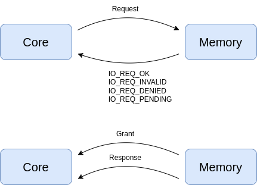

Interfaces
==========

Memory-mapped IO request
........................

This interface can be used to exchange memory accesses with a given address and size.

The protocol is shown on the following diagram.

The initiator of the request calls the request method on the master port, which triggers the handler execution
on the slave port.

The slave can then decide to either replies synchronously or asynchronously.

Synchronous replies mean that the master is getting the reply immediately when its function call returns.

In this case, the slave returns vp::IoReqStatus::OK if the access is valid, or vp::IoReqStatus::INVALID if it is
invalid.

In case of success, this means that the caller can immediately get the data in case of a read or assume the
data has been written in case of a write, and can go on.

Here is an example of synchronous reply:

.. code-block:: cpp

    vp::IoReqStatus MyComp::handle_request(vp::Block *__this, vp::IoReq *req)
    {
        MyComp *_this = (vp::Block *)__this;
        if (req->get_addr() == 0 && req->get_size() == 4)
        {
            if (req->get_is_write())
            {
                _this->reg_value = *(uint32_t *)req->get_data();
            }
            else
            {
                *(uint32_t *)req->get_data() = _this->reg_value;
            }
            return vp::IO_REQ_OK;
        }
        return vp::IO_REQ_INVALID;
    }

Asynchronous replies means the slave was not able to handle the request yet, and the master has to put the access on hold.

The slave can return from the function call with either vp::IoReqStatus::DENIED if the access was not granted or
vp::IoReqStatus::PENDING if the access was granted but the response could not be sent yet.

An access which is not granted can be used to model for example a FIFO which is full, and means the master could not
get rid of the request.

An access which is granted but not replied means the slave was able to queue the request and the master can go on
even though the response has not been received yet.

Here is an example of asynchronous reply:

.. code-block:: cpp

    vp::IoReqStatus MyComp::handle_request(vp::Block *__this, vp::IoReq *req)
    {
        MyComp *_this = (vp::Block *)__this;
        if (_this->fifo.size_left() < req->get_size())
        {
            _this->denied_queue.push(req);
            return vp::IO_REQ_DENIED;
        }
        else
        {
            _this->fifo.push(req);
            return vp::IO_REQ_PENDING;
        }
    }

In this example, the request is denied when the fifo has not enough room for the request, oterwise it is pushed to
the fifo.

Asynchronous replies are notified later on with a call to the slave port where the request was received. A
methods is available in the request to get the response port on which we can trigger a callback on the
initiator side.

Here is an example where a request which was denied is moved to the fifo once there is enough room, and the
initiator is notified so that it can update the timing model:

.. code-block:: cpp

    vp::IoReq *MyComp::pop_request()
    {
        vp::IoReq *req = this->fifo.pop();

        if (this->fifo.size_left() >= this->denied_queue.head()->get_size())
        {
            vp::IoReq *denied_req = _this->denied_queue.pop();
            this->fifo.push(denied_req);
            req->get_resp_port()->grant(denied_req):
        }

        return req;
    }

Granting a denied request can happen here for exemple because a pending request was handled, which freed some
room in the FIFO:

.. code-block:: cpp

    void MyComp::handle_requests(void *_this, vp::ClockEvent *event)
    {
        MyComp *_this = (vp::Block *)__this;
        vp::IoReq *req = _this->pop_request();
        if (req)
        {
            vp::IoReqStatus status = _this->output.req(req);
            if (status == vp::IO_REQ_OK || status == vp::IO_REQ_INVALID)
            {
                req->status = status;
                req->get_resp_port()->resp(req);
            }
        }
    }