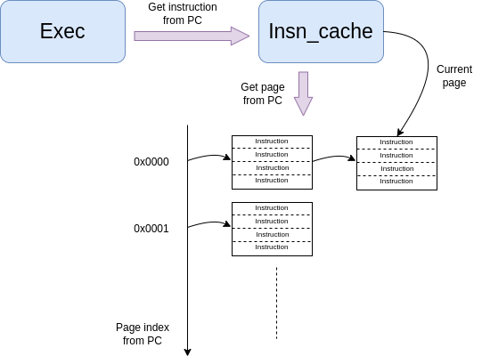
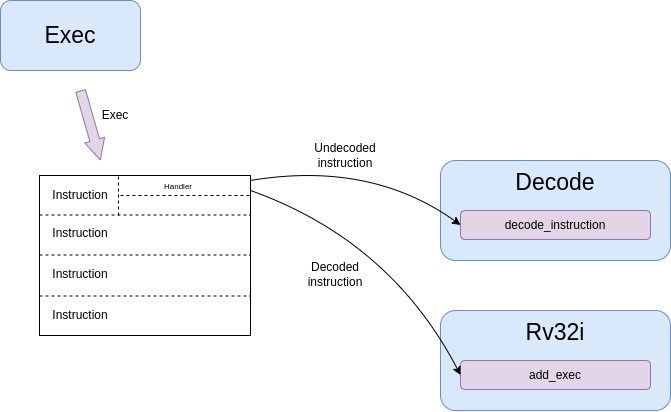

Models
======

ISS
...

Modules
-------

The ISS is made of the following modules interacting together:

- **prefetch**: it contains a local memory, typically 16 bytes, containing instructions prefetched from
  memory, so that the core cam get them locally. The whole memory is refilled at once when the next instruction is missing.
- **decode**: the first time an instruction is executed, it gets decode by this module in order to produce a structure containing all
  the information neded to model the instruction.
- **insn_cache**: it provides a cache of decoded instruction to the decode module so that decoded instructions
  can be found from their PC.
- **exec**: it is controlling the execution of instructions.
- **lsu**: it is in charge of generating memory requests. It handles misaligned accesses and asynchronous replies.
- **irq**: checking and handling of interrupts.
- **exception**: handling of exceptions,
- **core:**: manages reset, mstatus, and return from interrupt.
- **csr:**: manages CSR registers.
- **gdbserver**: manages core commands from GDB like breakpoints and step mode.
- **mmu**: MMU model.
- **pmp**: PMP model.
- **regfile**: register file.
- **resource**: implement a model of shared resource for timing purpose, base on bandwidth and latency, used for shared FPU.
- **syscalls**: OpenOCD semi-hosting plus additional semihosting for traces and VCD traces configuration.
- **timing**: set of functions for managing time modeling, like accounting stalls.
- **trace**: ISS instruction traces.

Core implementation
-------------------

There is one top class per core implementation which is charge of gathering all the modules needed for this
implementation.

This is an example for the ri5cy core.

.. code-block:: cpp

    class Iss
    {
    public:
        Iss(vp::Component &top);

        Exec exec;
        Timing timing;
        Core core;
        Regfile regfile;
        Prefetcher prefetcher;
        Decode decode;
        Irq irq;
        Gdbserver gdbserver;
        Lsu lsu;
        DbgUnit dbgunit;
        Syscalls syscalls;
        Trace trace;
        Csr csr;
        Mmu mmu;
        Pmp pmp;
        Exception exception;

        iss_pulp_nn_t pulp_nn;
        iss_rnnext_t rnnext;

        vp::Component &top;
    };

There are currently classes for ri5cy, snitch, spatz and generic riscv cores.

ISS execution model
-------------------

The ISS model execution is driven by a single clock event, whose main goal is to execute one instruction per cycle.
It is using a clock regular event, which is enabled when instructions should be executed, and disabled oterwise.
In order to easily model other activity in the ISS, especially for the handling of complex instructions, the event is
actually reused for various events, depending on what the core has to do in the next cycle.

As seen as the following diagram, this event can be used for executing instructions, as well for the page-table walk,
LSU complex operations or prefetching.

Chosing the right handler for the next cycle is done by changing the callback of the event.

.. image:: images/iss_event_model.png

The two main callbacks used for executing instructions are the following:

- The default slow one, which is checking everything.

- A fast one, which is activated as soon as the exec module detects that nothing special has to be checked. It switches back
  to slow callback as soon as something special happens, like an interrupt arrived, to check if it should be taken.

The fast callback is doing the following steps:

- Get the current PC (program counter). This is an integer so that it is compatible with mmu.

- Trigger a fetch to this pc. This is just for timing purpose, since instructions are already decoded.

- Get the instruction from the pc, using the instruction cache. This returns a pointer to the decoded instruction.

- Execute the instruction handler. This is just a call to a function pointer.

- Update the PC with the one returned by the instruction callback.

On top of that, the slow handler is adding these steps:

- If an exception is flagged, the current instruction is changed to exception one.

- Check if we can switch to fast handler (no gdb, no cycle counter, etc).

- Check if there any pending interrupt and handle it if so.

- Take care of gdbserver commands.

Instruction decoding
--------------------

The encoding of the instructions in the ISS must be described in a Python script so that the framework
can automatically generate the code for decoding instructions and dumping them in the instructions traces.

The encoding is described in this file: *core/models/cpu/iss/isa_gen/isa_riscv_gen.py*.

There is a first section in it which describes all the possible formats for the instructions.

Each format specifies how registers and immediates must be extracted from the opcode.

Here is a first example for instructions having 2 input registers and one output register:

.. code-block:: python

    if format == 'R':
        self.args = [   OutReg(0, Range(7,  5)),
                        InReg (0, Range(15, 5)),
                        InReg (1, Range(20, 5)),
                        ]

A different class must be used for input and output registers. The first argument gives
the register instruction index and the second gives the range in the opcode where the
register regfile index must be extracted.

The range is in this example a contiguous single range but it can also be made of several ranges put together.
In this example, the first argument is the first bit of the range and the second argument is the width of
the range.

Here is another example where an immediate is also extracted:

.. code-block:: python

    if format == 'I':
        self.args = [   OutReg(0, Range(7,  5)),
                        InReg (0, Range(15, 5)),
                        SignedImm(0, Range(20, 12)),
                    ]

The encoding of the instruction must give the instruction label, the instruction format, a string
describing the opcode, and additional options like tags.

The opcode can contain a dash for bits which are not relevant for the decoding because they are used
to encode registers or immediates.

Here are examples of encoded instructions. The tag can be used later on to track all instructions
of a certain kind, like here the ones doing a load, so that we can assign something like latency.

.. code-block:: python

    R5('lw',    'L',    '------- ----- ----- 010 ----- 0000011', tags=["load"]),
    R5('addi',  'I',    '------- ----- ----- 000 ----- 0010011'),

Instruction decoding cache
--------------------------

To increase the simulation speed of the ISS, the instructions are decoded only once using
a cache of decoded instructions.

Decoding an instruction consists in unpacking the opcode to extract all the register and immediate
information and find out which handler should take care of emulating the instruction.

All this information takes time to extract, thus they are done only once and then stored into
an unpacked instruction structure.

The role of the cache is to maintain a database of decoded instruction and allow the core to quickly
get them from the PC.

For that, as shown on the figure below, the exec module query the instruction cache to get the decoded
instruction for a certain PC.

To reduce the time neeed to access instructions, the cache is grouping them into pages of
instructions.

Since instructions are more likely to execute in sequence, the cache maintains a pointer to the current
instruction page, so that it first check if the required instruction is within the current page. If so,
this is the fastest look-up we can get and the instruction is returned. If not, the cache looks
for the page using a hash table. if this is a hit, the page becomes the current one and the instruction
is returned. If this is a miss, a new page is allocated, inserted into the hash and the instruction is
returned.

Since it takes quite some time to decode instructions, and we will most likely not use all the
instructions in a page, instructions are actually not decoded immediately. Just a pointer to the
instruction structure is returned.

Then to avoid adding checks on the critical path, the exec module will execute the model
of the instruction by calling the handler associated to the unpacked instruction structure.
This handler is initialized at first to be a decoding function, so that the first time the instruction
is executed, it is decoded. Then the next executions will directly jump to the right handler.

ISS customization
-----------------

The ISS is having some kind of flexibility to allow building on top of it several variants of cores.

The following is an example of how the ISS gets customized for the snitch core:

.. code-block:: python

    class Snitch(RiscvCommon):

        def __init__(self,
                parent,
                name,
                isa: str='rv32imafdc',
                misa: int=0,
                binaries: list=[],
                fetch_enable: bool=False,
                boot_addr: int=0):

            isa_instance = cpu.iss.isa_gen.isa_riscv_gen.RiscvIsa("snitch_" + isa, isa)

            super().__init__(parent, name, isa=isa_instance, misa=misa, core="snitch", scoreboard=True)

            self.add_c_flags([
                "-DPIPELINE_STAGES=1",
                "-DCONFIG_ISS_CORE=snitch",
            ])

            self.add_sources([
                "cpu/iss/src/snitch/snitch.cpp",
                "cpu/iss/src/spatz.cpp",
            ])

As we can see, snitch core is described with a specific class inheriting from a generic ISS. It overloads
a few parameters, like the core type, and the scoreboard which is enabled. Extra source code is given
to include some code specific to this core.

Here is another kind of customization which can be done in the ISS generator:

.. code-block:: python

    isa = cpu.iss.isa_gen.isa_riscv_gen.RiscvIsa(name, 'rv32imfc')

    isa.add_tree(IsaDecodeTree('sfloat', [Xf16(), Xf16alt(), Xf8(), Xfvec(), Xfaux()]))
    isa.add_tree(IsaDecodeTree('pulpv2', [PulpV2()]))

The ISA can be generated differently first by giving a different isa string, for what concerns generic isa
subsets. Then custom isa can be added by adding them to the tree.

Hereafter is the generic ISS class with all the possible parameters which can be customized
to get ISS variants:

.. code-block:: python

    def __init__(self,
            parent,
            name,
            isa,
            misa: int=0,
            first_external_pcer: int=0,
            riscv_dbg_unit: bool=False,
            debug_binaries: list=[],
            binaries: list=[],
            debug_handler: int=0,
            power_models: dict={},
            power_models_file: str=None,
            cluster_id: int=0,
            core_id: int=0,
            fetch_enable: bool=False,
            boot_addr: int=0,
            mmu: bool=False,
            pmp: bool=False,
            riscv_exceptions: bool=False,
            core='riscv',
            supervisor=False,
            user=False,
            internal_atomics=False,
            timed=True,
            scoreboard=False,
            cflags=None,
            prefetcher_size=None,
            wrapper="pulp/cpu/iss/default_iss_wrapper.cpp"):

        if supervisor:
            self.add_c_flags(['-DCONFIG_GVSOC_ISS_SUPERVISOR_MODE=1'])

ISS timing customization
------------------------

To customize the timing of the ISS, there is a first possibility to do it in the decoding tree.

This has the advantage of not requiring any modification to the C++ code, which can be easier to provide
several implementations of the same core.

Here is an example where we use the tags on the instructions to identify a certain kind of instructions
and attach some latency to it.

.. code-block:: python

    def __build_isa(name):
        isa = cpu.iss.isa_gen.isa_riscv_gen.RiscvIsa(name, 'rv32imfcXpulpv2Xf8Xf16XfvecXfauxXf16altXgap9')

        isa.add_tree(IsaDecodeTree('sfloat', [Xf16(), Xf16alt(), Xf8(), Xfvec(), Xfaux()]))
        isa.add_tree(IsaDecodeTree('pulpv2', [PulpV2()]))

        for insn in isa.get_insns():

            if "load" in insn.tags:
                insn.get_out_reg(0).set_latency(2)
            elif "mul" in insn.tags:
                insn.get_out_reg(0).set_latency(2)
            elif "mulh" in insn.tags:
                insn.set_latency(5)

        return isa

There is another big advantage of timing an instruction here. The decoder will detect it and will decode the instruction
in a specific way which will allow taking into account the latency without requiring any additional check at runtime.

In the example below, this is used to model the data dependency which can happen between a load and the next
instruction. Checking that at runtime requires monitoring every register access to see if one instruction tries to
read a register the cycle after a load read data from memory to this register. This means adding a check at every cycle.

To avoid that, the decoder detects the dependency while decoding the instruction and only if it is found, replace
the normal instruction callback by a slower one adding the latency. The good thing is that most of the time,
the compiler will take care of avoiding the data dependency, so we avoid doing one check per cycle for a rare case.

Here is another example where we modify the isa to add a shared resource which is modeling the fact
that floating-point instructions are offloading to a shared FPU, which can create some contentions.

.. code-block:: python

    def __build_cluster_isa():

        def __attach_resource(insn, resource, latency, bandwidth, tags=[]):
            if len(tags) == 0:
                insn.attach_resource(resource, latency, bandwidth)
            else:
                for tag in tags:
                    if tag in insn.tags:
                        insn.attach_resource(resource, latency, bandwidth)

        isa = __build_isa('pulp_cluster')

        # Declare the 3 kind of shared resources with appropriate latency and bandwidth
        isa.add_resource('fpu_base', instances=4)
        isa.add_resource('fpu_sqrt', instances=1)

        # And attach resources to instructions
        for insn in isa.get_tree('f').get_insns() + isa.get_tree('sfloat').get_insns():

            # All float operations are handled by the same unit
            __attach_resource(insn, 'fpu_base', latency=1, bandwidth=1, tags=[
                'fmadd', 'fadd', 'fmul', 'fconv', 'fother',
                'sfmadd', 'sfadd', 'sfmul', 'sfconv', 'sfother',
            ])

            # Except div, rem and sqrt which goes to the sqrt unit
            __attach_resource(insn, 'fpu_sqrt', latency=14, bandwidth=14, tags=[
                'fdiv'
            ])

            # Except div, rem and sqrt which goes to the sqrt unit
            __attach_resource(insn, 'fpu_sqrt', latency=10, bandwidth=10, tags=[
                'sfdiv'
            ])

        return isa

The instruction is functionnally executed in the ISS the standard way, and then the resource model is applied
to compute the contentions.

For that, each resource is assign a bandwidth and a latency. The latency tells after how many cycles
the instruction result is available, which can stall the core if its pipeline is not deep enough.
Then the bandwith indicates how many cycles it needs to take the next instruction.

The resource model is keeping track of the cycle where the next instruction can be accepted, based on the bandwidth
and will apply stalls if another instruction is coming before that.

For lots of cases, this way of customizing the timing on the isa is not suitable because for example
the number of cycles of the instruction depends on something we only know during execution like the value of the
registers.

This is the case for example for the iming of the div instruction on ri5cy core, as it depends on the number
of zero. The instruction can still be correctly timed by calling some functions in the timing module:

.. code-block:: cpp

    int cycles;

    if (divider == 0)
    {
        cycles = 1;
    }
    else if (divider > 0)
    {
        cycles = __builtin_clz(divider) + 3;
    }
    else
    {
        cycles = __builtin_clz((~divider) + 1) + 2;
    }

    iss->timing.stall_insn_dependency_account(cycles);

In this case, the number of cycles is computed depending on the register value, and the core is stalled
for the estimated amount of cycles.

The main drawback of this approach is that it makes it more difficult to maintain several implementions of the core
as it is increasing the number of ifdef in the code.

Another example is the timing of the compare and branch instruction, where the stalls must be applied
only if the branch is taken:

.. code-block:: cpp

    inline void Timing::stall_taken_branch_account()
    {
        this->stall_cycles_account(2);
        this->event_branch_account(1);
        this->event_taken_branch_account(1);
    }

L1 interconnect
...............

.. code-block:: cpp

    vp::IoReqStatus interleaver::req(vp::Block *__this, vp::IoReq *req)
    {
        interleaver *_this = (interleaver *)__this;
        uint64_t offset = req->get_addr();
        bool is_write = req->get_is_write();
        uint64_t size = req->get_size();
        uint8_t *data = req->get_data();

        _this->trace.msg("Received IO req (offset: 0x%llx, size: 0x%llx, is_write: %d)\n", offset, size, is_write);

        int bank_id = (offset >> 2) & _this->bank_mask;
        uint64_t bank_offset = ((offset >> (_this->stage_bits + 2)) << 2) + (offset & 0x3);

        req->set_addr(bank_offset);
        return _this->out[bank_id]->req_forward(req);
    }

Converter
.........

.. code-block:: cpp

    void converter::event_handler(vp::Block *__this, vp::ClockEvent *event)
    {
        converter *_this = (converter *)__this;
        vp::IoReq *req = _this->pending_req;
        _this->pending_req = req->get_next();

        _this->trace.msg("Sending partial packet (req: %p, offset: 0x%llx, size: 0x%llx, is_write: %d)\n",
            req, req->get_addr(), req->get_size(), req->get_is_write());

        vp::IoReqStatus err = _this->out.req(req);
        if (err == vp::IO_REQ_OK)
        {
            _this->ready_cycle = _this->clock.get_cycles() + req->get_latency() + 1;
            _this->ongoing_size -= req->get_size();
            if (_this->ongoing_size == 0)
            {
            vp::IoReq *req = _this->ongoing_req;
            _this->trace.msg("Finished handling request (req: %p)\n", req);
            _this->ongoing_req = NULL;
            req->set_latency(req->get_latency() + 1);
            req->get_resp_port()->resp(req);

            if (_this->stalled_req)
            {
                req = _this->stalled_req;
                _this->trace.msg("Unstalling request (req: %p)\n", req);
                _this->stalled_req = req->get_next();
                req->get_resp_port()->grant(req);

                _this->process_pending_req(req);
            }
            }
        }
        else
        {
            _this->ready_cycle = INT32_MAX;
        }

        _this->check_state();
        }

        void converter::check_state()
        {
        if (pending_req)
        {
            int64_t cycle = clock.get_cycles();
            int64_t latency = 1;
            if (ready_cycle > cycle) latency = ready_cycle - cycle;
            if (!event->is_enqueued()) event_enqueue(event, latency);
        }
    }

    vp::IoReqStatus converter::process_pending_req(vp::IoReq *req)
    {
        uint64_t offset = req->get_addr();
        uint64_t size = req->get_size();
        uint8_t *data = req->get_data();
        bool is_write = req->get_is_write();

        int mask = output_align - 1;

        ongoing_req = req;
        ongoing_size = size;

        while (size)
        {
            int iter_size = output_width;
            if (offset & mask) iter_size -= offset & mask;
            if (iter_size > size) iter_size = size;

            vp::IoReq *req = out.req_new(offset, data, iter_size, is_write);
            req->set_next(pending_req);
            pending_req = req;

            size -= iter_size;
            offset += iter_size;
            data += iter_size;
        }

        return vp::IO_REQ_PENDING;
    }

    vp::IoReqStatus converter::process_req(vp::IoReq *req)
    {
        uint64_t offset = req->get_addr();
        uint64_t size = req->get_size();
        uint8_t *data = req->get_data();
        bool is_write = req->get_is_write();

        int mask = output_align - 1;

        // Simple case where the request fit, just forward it
        if ((offset & ~mask) == ((offset + size - 1) & ~mask))
        {
            trace.msg("No conversion applied, forwarding request (req: %p)\n", req);
            return out.req_forward(req);
        }

        return this->process_pending_req(req);
    }

    vp::IoReqStatus converter::req(vp::Block *__this, vp::IoReq *req)
    {
        converter *_this = (converter *)__this;
        uint64_t offset = req->get_addr();
        bool is_write = req->get_is_write();
        uint64_t size = req->get_size();
        uint8_t *data = req->get_data();

        _this->trace.msg("Received IO req (req: %p, offset: 0x%llx, size: 0x%llx, is_write: %d)\n", req, offset, size, is_write);

        if (_this->ongoing_req)
        {
            _this->trace.msg("Stalling request (req: %p)\n", req);

            if (_this->stalled_req)
            _this->last_stalled_req->set_next(req);
            else
            _this->stalled_req = req;
            req->set_next(NULL);
            _this->last_stalled_req = req;

            return vp::IO_REQ_DENIED;
        }

        if (_this->process_req(req) == vp::IO_REQ_OK)
            return vp::IO_REQ_OK;

        _this->check_state();

        return vp::IO_REQ_PENDING;
    }
