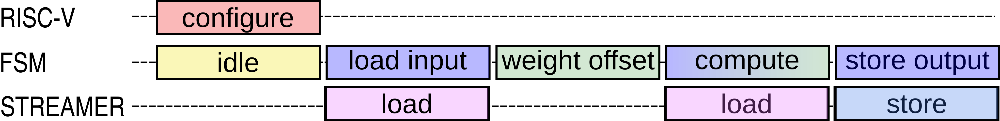

3 - Intrinsics of the Hwpe development
......................................
The HWPE (Hardware Processing Engine) we are modeling today is a basic module designed to perform pointwise convolution. The execution steps are illustrated in the diagram below.

Initially, the HWPE's finite state machine (FSM) is in the IDLE state. Configuration of the HWPE is done by one of the RISC-V cores within the cluster through memory-mapped registers. These registers are used to set the input pointer, weight pointer, output pointer, and other necessary parameters. Once the execution is triggered, the HWPE begins with ``load input`` loading the input features into the input buffer. During the ``weight offset`` phase, any negative weights are adjusted. The FSM then transitions to the ``compute`` phase, where the weights are loaded using the streamer, and partial sums are computed. Finally, the output is stored in the L1 memory using the streamer in ``store output`` phase.

The datapath of the HWPE is depicted in the following figure. The 8-bit multiplication is performed using a combination of addition and shifts, with the assumption that weight data is arranged in memory with negative weights already offset. The input feature is broadcasted to 8 parallel 1x8-bit multipliers, each responsible for one input channel—here, we use a total of 32 channels in parallel. The Adder Tree Column handles the addition within each column, while the Adder Tree Processing Engine (PE) manages the addition across the processing engine. The partial sum is accumulated in the psum buffer. The multiplier is primarily used to apply the weight offset; otherwise, it is bypassed.

.. image:: ../../images/hwpe/datapath.png

This section is devoted to the implementation details of the C++ model of the Hwpe. We will also club
it with the software infrastructure as they are necessary to verify the hardware infrastructure. A brief
introduction of the software is given below.

.. toctree::
   :maxdepth: 2

   task3/task_0
   task3/task_1
   task3/task_2
   task3/task_3
   task3/task_4
   task3/task_5
   task3/task_6
   task3/task_7
   task3/task_8