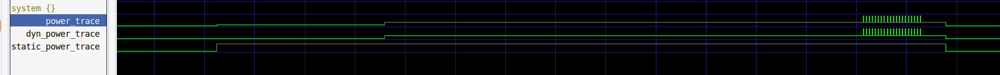
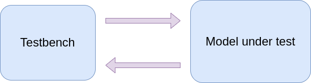

Tutorials
---------

0 - How to build a system from scratch
......................................

The goal of this tutorial is to build a simple system from scratch containing a core,
an interconnect and a memory.

The tutorial is located here: docs/developer/tutorials/0_how_to_build_a_system_from_scratch

The solution is under directory *solution*.

A simple runtime is available here: docs/developer/tutorials/utils

A makefile is available in the tutorial for compiling gvsoc, compiling the application to be
simulated, and running the simulation.

GVSOC can be compiled with *make gvsoc*, using this target: ::

    gvsoc:
        make -C ../../../.. TARGETS=my_system MODULES=$(CURDIR) build

It adds our local directory to the list of GVSOC modules so that it can find our system. This command is for now
failing as we need to write the script describing our system.

Compiling and running the application can be done with *make all run*. The run target also
adds our local directory to the list of target dirs so that it can find our system: ::

    run:
	    gvsoc --target-dir=$(CURDIR) --target=my_system --work-dir=$(BUILDDIR) --binary=$(BUILDDIR)/test run $(runner_args)

Now, in order to build a system scratch, we need to write a python generator of the system which
will assemble all the pieces together.

First we need to declare our system as a gapy target, which is the runner used to run GVSOC
simulation:

.. code-block:: python

    import gvsoc.runner

    GAPY_TARGET = True

    class Target(gvsoc.runner.Target):

        def __init__(self, parser, options):
            super(Target, self).__init__(parser, options,
                model=Rv64, description="RV64 virtual board")

The target should aways inherit from *gvsoc.runner.Target* and we should always put
*GAPY_TARGET = True* in the file so that gapy knows this is a valid target when we put it on
gapy command-line.

The *model* argument should give the class of our system that we will describe now.

First we will put a top component whose role is to provide a clock to the rest of the system.
The top component must always inherit from *gvsoc.systree.Component*, and contain and propagate all the
following options:

.. code-block:: python

    class Rv64(gvsoc.systree.Component):

        def __init__(self, parent, name, parser, options):
            super().__init__(parent, name, options=options)

Only the parser option does not need to be propagated but can be used to declare or get options
from the command-line.

Now we can instantiate a clock generator and give it the initial frequency:

.. code-block:: python

    import vp.clock_domain

.. code-block:: python

    clock = vp.clock_domain.Clock_domain(self, 'clock', frequency=100000000)

Then let's instantiate our real system and connect its clock to the clock generator.
Since we connect the whole system to the clock generator, the same clock will be propagated
to all components in our system:

.. code-block:: python

    soc = Soc(self, 'soc', parser)
    clock.o_CLOCK    (soc.i_CLOCK    ())

Each component is providing methods for getting input ports and connecting output ports, that we
can use to connect our components together.

Now we can declare our real system:

.. code-block:: python

    class Soc(gvsoc.systree.Component):

        def __init__(self, parent, name, parser):
            super().__init__(parent, name)

            # Parse the arguments to get the path to the binary to be loaded
            [args, __] = parser.parse_known_args()

            binary = args.binary

We give it the top parser so that it can get the path of the binary to be simulated, which we
will use later for the loading.

We first instantiate the memory. We give it its size, which is passed as method parameter.
The Python generator of the memory component will declare it as a property, which will make sure
it is passed to the C++ model through its JSON configuration.

.. code-block:: python

    import memory.memory

.. code-block:: python

    mem = memory.memory.Memory(self, 'mem', size=0x00100000)

Then the interconnect. We bind the interco to the memory with a special binding, since we route
requests to the memory only for a certain range of the memory map.

.. code-block:: python

    import interco.router

.. code-block:: python

    ico = interco.router.Router(self, 'ico')
    ico.o_MAP(mem.i_INPUT(), 'mem', base=0x00000000, remove_offset=0x00000000, size=0x00100000)

The range is specified using *base* and *size*. The other argument, *remove_offset* can be used
to remap the base address of the requests, so that they arrive in the memory component with
a local offset.

Now we can add and bind the core. We take a default riscv core:

.. code-block:: python

    import cpu.iss.riscv

.. code-block:: python

    host = cpu.iss.riscv.Riscv(self, 'host', isa='rv64imafdc')
    host.o_FETCH     (ico.i_INPUT    ())
    host.o_DATA      (ico.i_INPUT    ())
    host.o_DATA_DEBUG(ico.i_INPUT    ())

We connect everything to the interconnect so that all requests are routed to the memory. The ISS
needs one port for fetching instructions and one for data, in case they need to follow different
paths for timing purpose. We also connect the debug port so that we can also connect GDB.

The next component is not modeling any hardware, but is just here to allow loading the binary to be
simulated.

.. code-block:: python

    import utils.loader.loader

.. code-block:: python

    loader = utils.loader.loader.ElfLoader(self, 'loader', binary=binary)
    loader.o_OUT     (ico.i_INPUT    ())
    loader.o_START   (host.i_FETCHEN ())
    loader.o_ENTRY   (host.i_ENTRY   ())

We need the loader because GVSOC does not provide any debug feature for loading binaries, as
everything should be simulated using the timing models.

The loader will issue requests to the memory to copy the binary sections. Once done, it will send
the boot address to the core and activate its fetch enable pin so that it can start executing
the binary.

The last component, which is optional, is to put a GDB server so that we can connect GDB to debug
our binary execution.

.. code-block:: python

    import gdbserver.gdbserver

.. code-block:: python

    gdbserver.gdbserver.Gdbserver(self, 'gdbserver')

Now we can compile gvsoc with *make gvsoc*. Since it will execute our script to know which components
should be built, it is possible that we get some Python errors at this point.

Then we can run the simulation with "make all run".

We can activate instruction traces to see what happened: ::

    make all run runner_args="--trace=insn"

In order to connect GDB, we can run the simulation with "make run runner_args=--gdbserver". This will
open an RSP socket and wait for gdb connection which can then be launcher from another
terminal with: ::

    riscv64-unknown-elf-gdb build/test
    (gdb) target remote:12345
    Remote debugging using :12345
    _start () at ../utils/crt0.S:5
    5	    la    x2, stack
    (gdb) break main
    Breakpoint 1 at 0x2c16: file main.c, line 5.
    (gdb) c
    Continuing.

    Breakpoint 1, main () at main.c:5
    5	    printf("Hello\n");
    (gdb)

1 - How to write a component from scratch
.........................................

The goal is this tutorial is to write a component from scratch, add it to our previous system,
and access it from the simulated binary.

For that, we modified the application and we now put in it an access to a dedicated region, that
we want to redirect to our component:

.. code-block:: cpp

    int main()
    {
        printf("Hello, got 0x%x from my comp\n", *(uint32_t *)0x20000000);
        return 0;
    }

First we need to create a python script called *my_comp.py* and declare our component in it:

.. code-block:: python

    import gvsoc.systree

    class MyComp(gvsoc.systree.Component):

        def __init__(self, parent: gvsoc.systree.Component, name: str, value: int):
            super().__init__(parent, name)

Python generators are always getting these *parent* and *name* options which needs to be given
to the parent class. The first one is giving the parent which instantiated this component, and
the second gives the name of the component within its parent scope.

Additional options can then be added to let the parent parametrize the instance of this component,
like previously the size of the memory. Here we add the *value* option to let the parent gives the
value to be read by the simulated binary.

Then we need to specify the source code of this component. Several sources can be given.
That is all we need to trigger the compilation of this component, the framework will automically
make sure a loadable library is produced for our component.

.. code-block:: python

    self.add_sources(['my_comp.cpp'])

It is also possible to give cflags. Both cflags and sources can depend on the component parameters,
the framework will make sure it compiles 2 differents libraries since the static code is different.

Since we added an option, we need to declare it as a property, so that it is added into the JSON
configuration of the component, and so that the code can retrieve it.

.. code-block:: python

    self.add_properties({
        "value": value
    })

Our component will have an input port to receive incoming requests. It is good to declare a method
for it so that it is easy for the upper component to know what needs to be bound:

.. code-block:: python

    def i_INPUT(self) -> gvsoc.systree.SlaveItf:
        return gvsoc.systree.SlaveItf(self, 'input', signature='io')

The name of the interface here should corresponds to the one in the C++ code to declare the port.
The signature is just an information for the framework so that it can check that we are binding
ports of the same kind.

Now we need to write the C++ code. We have to first declare a class which inherits from
*vp::Component*:

.. code-block:: cpp

    class MyComp : public vp::Component
    {

    public:
        MyComp(vp::ComponentConf &config);

    };

    extern "C" vp::Component *gv_new(vp::ComponentConf &config)
    {
        return new MyComp(config);
    }

The argument passed to our class is just here to propagate it to the parent class.

A C wrapping function called *gv_new* is needed to let the framework instantiate our class when
the shared library containing our component is loaded.

Now we need to declare in our class an input port where the requests from the core will be received.
This port will be associated a method which will get called everytime a request must be handled.
This method must be static, and will receive the class instance as first argument and the request as
second argument. We can also add in the class a variable which will hold the value to be returned.

.. code-block:: cpp

    private:
        static vp::IoReqStatus handle_req(void *__this, vp::IoReq *req);

        vp::IoSlave input_itf;

        uint32_t value;

Now we must write the constructor of our class. This one should contain the declaration of our input port.
It is also the place where it can read the JSON configuration to get the parameters which were given to
our Python instance:

.. code-block:: cpp

    MyComp::MyComp(vp::ComponentConf &config)
        : vp::Component(config)
    {
        this->input_itf.set_req_meth(&MyComp::handle_req);
        this->new_slave_port("input", &this->input_itf);

        this->value = this->get_js_config()->get_child_int("value");
    }

Finally we can implement our port handler, whose role is to detect a read at offset 0 and returns
the value specified in the Python instance:

.. code-block:: cpp

    vp::IoReqStatus MyComp::handle_req(vp::Block *__this, vp::IoReq *req)
    {
        MyComp *_this = (MyComp *)__this;

        printf("Received request at offset 0x%lx, size 0x%lx, is_write %d\n",
            req->get_addr(), req->get_size(), req->get_is_write());
        if (!req->get_is_write() && req->get_addr() == 0 && req->get_size() == 4)
        {
            *(uint32_t *)req->get_data() = _this->value;
        }
        return vp::IO_REQ_OK;
    }

The cast is needed because this handler is static.

The last step is to add our component in our previous system and connect it on the interconnect so
that accesses at 0x20000000 are routed to it.

For that it must first be imported:

.. code-block:: python

    import my_comp

And then instantiated:

.. code-block:: python

    comp = my_comp.MyComp(self, 'my_comp', value=0x12345678)
    ico.o_MAP(comp.i_INPUT(), 'comp', base=0x20000000, size=0x00001000, rm_base=True)

We can now compile gvsoc. Since our component is included into the system, the framework will automatically
compile it.

We can compile and run the application, which should output: ::

    Received request at offset 0x0, size 0x4, is_write 0
    Hello, got 0x12345678 from my comp

2 - How to make components communicate together
...............................................

The goal of this tutorial is to create a second component and connect it to our previous component
so that they interact together.

For that, our previous component, when it receives the read from the core, will now also notify
the other component, through a wire interface. Then the new component will in turn reply to this
component through a second binding.

First, let's enrich our first component with 2 ports, one for sending the notification, and one for
receiving the result:

.. code-block:: python

    def o_NOTIF(self, itf: gsystree.SlaveItf):
        self.itf_bind('notif', itf, signature='wire<bool>')

    def i_RESULT(self) -> gsystree.SlaveItf:
        return gsystree.SlaveItf(self, 'result', signature='wire<MyResult>')

Both are using the wire interface, which is an interface which can be used for sending values to
another component. This interface is a template, so that the type of the value to be exchanged
can be chosen.

In our case, the notif interface with send a boolean, and the result will receive a custom class.

In the same Python script we can then describe our second component:

.. code-block:: python

    class MyComp2(gsystree.Component):

        def __init__(self, parent: gsystree.Component, name: str):

            super().__init__(parent, name)

            self.add_sources(['my_comp2.cpp'])

        def i_NOTIF(self) -> gsystree.SlaveItf:
            return gsystree.SlaveItf(self, 'notif', signature='wire<bool>')

        def o_RESULT(self, itf: gsystree.SlaveItf):
            self.itf_bind('result', itf, signature='wire<MyResult>')

It has same interfaces but reversed in direction.

Now we have to declare the two new interfaces in our first component:

.. code-block:: cpp

    this->new_master_port("notif", &this->notif_itf);

    this->result_itf.set_sync_meth(&MyComp::handle_result);
    this->new_slave_port("result", &this->result_itf);

Since the second one is a slave interface and will receive values, it also needs to be
associated a handler, which will get called when the other component is sending a value.

We can then modify our previous handler to also send a notification to the second component:

.. code-block:: cpp

    _this->notif_itf.sync(true);

The handler for the result port can then be declared and implemented:

.. code-block:: cpp

    static void handle_result(void *__this, MyClass *result);

.. code-block:: cpp

    void MyComp::handle_result(void *__this, MyClass *result)
    {
        printf("Received results %x %x\n", result->value0, result->value1);
    }

Note that the type of the value can be anything, including a custom class, like in our case.
This allows exchanging complex data between components.

The second component can then be implemented:

.. code-block:: cpp

    class MyComp : public vp::Component
    {

    public:
        MyComp(vp::ComponentConf &config);

    private:
        static void handle_notif(void *__this, bool value);
        vp::WireSlave<bool> notif_itf;
        vp::WireMaster<MyClass *> result_itf;
    };

    MyComp::MyComp(vp::ComponentConf &config)
        : vp::Component(config)
    {
        this->notif_itf.set_sync_meth(&MyComp::handle_notif);
        this->new_slave_port("notif", &this->notif_itf);

        this->new_master_port("result", &this->result_itf);
    }

    void MyComp::handle_notif(void *__this, bool value)
    {
        MyComp *_this = (MyComp *)__this;

        printf("Received value %d\n", value);

        MyClass result = { .value0=0x11111111, .value1=0x22222222 };
        _this->result_itf.sync(&result);
    }

    extern "C" vp::Component *gv_new(vp::ComponentConf &config)
    {
        return new MyComp(config);
    }

Note that it will send the result immediately when it receives the notification, which means the first
component will receive a method call while it is calling another component.

This is a case which often happens for simulation speed reason, so everytime we call an interface, we have
to make sure that the internal state of the component is in a coherent state.

The final step is to instantiate the second component and bind it with the first one:

.. code-block:: python

        comp2 = my_comp.MyComp2(self, 'my_comp2')
        comp.o_NOTIF(comp2.i_NOTIF())
        comp2.o_RESULT(comp.i_RESULT())

Now we can compile and run to get: ::

    Received request at offset 0x0, size 0x4, is_write 0
    Received value 1
    Received results 11111111 22222222
    Hello, got 0x12345678 from my comp

3 - How to add system traces to a component
...........................................

The goal of this tutorial is to show how to add system traces into our components.

The trace must first be declared into our component class:

.. code-block:: c++

    vp::Trace trace;

Then, the trace must be activated, and given a name. This name is the one we will see in the path
of the trace when it is dumped, and is also the one used for selecting the trace on the command line.

.. code-block:: c++

    this->traces.new_trace("trace", &this->trace);

The trace can then be dumped from our model using this code that we put at the beginning of our request
handler, in order to show information about the request:

.. code-block:: c++

    vp::IoReqStatus MyComp::handle_req(vp::Block *__this, vp::IoReq *req)
    {
        MyComp *_this = (MyComp *)__this;

        _this->trace.msg(vp::TraceLevel::DEBUG, "Received request at offset 0x%lx, size 0x%lx, is_write %d\n",
            req->get_addr(), req->get_size(), req->get_is_write());

Once gvsoc has been recompiled, we can then activate all the traces of our component with this command: ::

    make all run runner_args="--trace=my_comp"

The value to the option *--trace* is a regular expression used to enable all traces whose path is matching this pattern.

It is also possible to activate instruction traces at the same time to see where is done the access: ::

    make all run runner_args="--trace=my_comp --trace=insn"

This should dump: ::

    32470000: 3247: [/soc/host/insn                 ] main:0                           M 0000000000002c26 lui                 a5, 0x20000000            a5=0000000020000000
    32590000: 3259: [/soc/my_comp/trace             ] Received request at offset 0x0, size 0x4, is_write 0
    32590000: 3259: [/soc/host/insn                 ] main:0                           M 0000000000002c2a c.lw                a1, 0(a5)                 a1=0000000012345678  a5:0000000020000000  PA:0000000020000000

4 - How to add VCD traces to a component
........................................

The goal of this tutorial is to show how to add VCD traces to our component so that its activity
can be monitored from a VCD viewer like GTKwave.

The easiest way to dump a VCD trace is to declare a signal that we will use to set the value which
will be displayed on the viewer.

For that we first have to declare it in our component class:

.. code-block:: c++

    vp::Signal<uint32_t> vcd_value;

The signal is a template. Its type is the one of the value which will store the value of the signal. This type should
have at least the width of the signal.

Then the signal must be declared, and given a name and a width. This name is the name we will see in
the viewer and the one we can use on the command line to enable the VCD trace associated to
this signal.

.. code-block:: c++

    MyComp::MyComp(vp::ComponentConf &config)
        : vp::Component(config), vcd_value(*this, "status", 32)

Then, the signal can be given a value with the *set* method. All the changes of values done through
this method will be seen on the VCD viewer.

One interesting feature is to call the *release* method on the signal in order to show it in high
impedance. This can be useful to show some kind of idleness.

In our example, our signal will just display the value written by the core, except for a certain value
which will be showed as high impedance:

.. code-block:: c++

    if (!req->get_is_write())
    {
        *(uint32_t *)req->get_data() = _this->value;
    }
    else
    {
        uint32_t value = *(uint32_t *)req->get_data();
        if (value == 5)
        {
            _this->vcd_value.release();
        }
        else
        {
            _this->vcd_value.set(value);
        }
    }

Once GVSOC has been recompiled, we can activate VCD tracing and enable all events with this command: ::

    make all run runner_args="--vcd --event=.*"

This should suggest a GTKwave command to be launched.

Once GTKwave is opened, on the SST view on the left, our signal can be seen under soc->my_comp. It
can then be added to the view by clicking on "Append" on the bottom left.

In order to automatically put our signal into the cental view without having to pick the signal
from the signal view, we can also modify our component generator to include these lines:

.. code-block:: python

    def gen_gtkw(self, tree, comp_traces):

        if tree.get_view() == 'overview':
            tree.add_trace(self, self.name, vcd_signal='status[31:0]', tag='overview')

5 - How to add a register map in a component
............................................

The goal of this tutorial is to show how to implement a register map in a component.

For that we will first show how to model the registers by hands, and in a second step how to use
a script to generate the code to handle the register map from a markdown description of it.

First let's add it by hands. This is pretty simple. Our component is getting a function call to his
request handler everytime our component is accessed. The handler can get the offset of the access
from the request and determine from that which register is being accessed.

In our case, we will have 2 registers, one at offset 0x0 containing what we did before and a new one
at offset 0x4, which is returning the double of the value coming from Python generators.

.. code-block:: cpp

    vp::IoReqStatus MyComp::handle_req(vp::Block *__this, vp::IoReq *req)
    {
        MyComp *_this = (MyComp *)__this;

        _this->trace.msg(vp::TraceLevel::DEBUG, "Received request at offset 0x%lx, size 0x%lx, is_write %d\n",
            req->get_addr(), req->get_size(), req->get_is_write());

        if (req->get_size() == 4)
        {
            if (req->get_addr() == 0)
            {
                if (!req->get_is_write())
                {
                    *(uint32_t *)req->get_data() = _this->value;
                }
                else
                {
                    uint32_t value = *(uint32_t *)req->get_data();
                    if (value == 5)
                    {
                        _this->vcd_value.release();
                    }
                    else
                    {
                        _this->vcd_value.set(value);
                    }
                }
            }
            else if (req->get_addr() == 4)
            {
                if (!req->get_is_write())
                {
                    *(uint32_t *)req->get_data() = _this->value * 2;
                }
            }
        }
    }

Things are easy here because we only supports 32bits aligned accesses to our registers which is
quite common. This requires more work if we want to support 8bits or 16bits unaligned accesses, like doing some
memcopies.

To simplify, the *Register* object can be used to update the value
with a method, and then check his full value to impact the model. This will also provide at the same
time support for system traces and VCD traces.

For that it first need to be declared and configured, similarly to what we have done with the *Signal* object:

.. code-block:: cpp

    vp::Register<uint32_t> my_reg;

.. code-block:: cpp

    MyComp::MyComp(vp::ComponentConf &config)
        : vp::Component(config), vcd_value(*this, "status", 32), my_reg(*this, "my_reg", 32)

Then the following code can be added in the handler. It is checking that the beginning of the request falls
into the register area, and if so update the register value using the method. Then it can check the full value
of the register to take an action, just a printf in our example.

.. code-block:: cpp

    if (req->get_addr() >= 8 && req->get_addr() < 12)
    {
        _this->my_reg.update(req->get_addr() - 8, req->get_size(), req->get_data(),
            req->get_is_write());

        if (req->get_is_write() && _this->my_reg.get() == 0x11227744)
        {
            printf("Hit value\n");
        }

        return vp::IO_REQ_OK;
    }

The following code can be added into the simulated binary in order to access our new register:

.. code-block:: cpp

    *(uint32_t *)0x20000008 = 0x11223344;
    *(uint8_t *)0x20000009 = 0x77;

    printf("Hello, got 0x%x at 0x20000008\n", *(uint32_t *)0x20000008);

Then after recompiling gvsoc, we can see the activity in the register with these options: ::

    make all run runner_args="--trace=my_comp/my_reg --trace-level=trace"

Which should displays: ::

    128290000: 12829: [/soc/my_comp/my_reg/trace             ] Modified register (value: 0x11223344)
    128310000: 12831: [/soc/my_comp/my_reg/trace             ] Modified register (value: 0x11227744)
    Hit value
    Hello, got 0x11227744 at 0x20000008

Now let's have a look at a way of generating the register map. For that we will use the *regmap-gen*
script which comes with gvsoc and allows geenrating the register map code from a register map described
in a markdown file.

Lets' first add this rule in the makefile to generate the register map: ::

    regmap:
        regmap-gen --input-md regmap.md --header headers/mycomp

Now let's describe the register map. This file should first describe the set of registers of the
regmap. Then for each register, it should describe all the fields of the register. This will be used
to generate accessors for each field of each register, to make it easy for the mdoel to handle
the registers, and also to generate detailed traces.

.. code-block:: markdown

    # MyComp

    ## Description

    ## Registers

    | Register Name | Offset | Size | Default     | Description      |
    | ---           | ---    | ---  | ---         | ---              |
    | REG0          | 0x00   | 32   | 0x00000000  | Register 0       |
    | REG1          | 0x04   | 32   | 0x00000000  | Register 1       |

    ### REG0

    #### Fields

    | Field Name | Offset | Size  | Default | Description |
    | ---        | ---    | ---   | ---     | ---         |
    | FIELD0     | 0      | 8     | 0x00    | Field 0     |
    | FIELD1     | 8      | 24    | 0x00    | Field 1     |

    ### REG1

    #### Fields

    | Field Name | Offset | Size  | Default | Description |
    | ---        | ---    | ---   | ---     | ---         |
    | FIELD0     | 0      | 8     | 0x00    | Field 0     |
    | FIELD1     | 8      | 8     | 0x00    | Field 1     |
    | FIELD2     | 16     | 8     | 0x00    | Field 2     |
    | FIELD3     | 24     | 8     | 0x00    | Field 3     |

Once executed, the script should generate several files in the *header* directory, that we can include
into our model to instantiate the register map.

For that we must first include these two files:

.. code-block:: cpp

    #include "headers/mycomp_regfields.h"
    #include "headers/mycomp_gvsoc.h"

Then the register map must be declared into our component class:

.. code-block:: cpp

    vp_regmap_regmap regmap;

It must then be configured in our class constructor. A trace must be given, which will be used to trace
register accesses. We can use our class trace for that.

.. code-block:: cpp

    this->regmap.build(this, &this->trace);

In case we need to catch accesses to some registers when they are accessed, in order to take some actions,
we can attach a callback, which will get called everytime it is accessed:

.. code-block:: cpp

    this->regmap.reg0.register_callback(std::bind(
        &MyComp::handle_reg0_access, this, std::placeholders::_1, std::placeholders::_2,
        std::placeholders::_3, std::placeholders::_4), true);

The callback needs to update the value of the register, and can do additional things:

.. code-block:: cpp

    void MyComp::handle_reg0_access(uint64_t reg_offset, int size, uint8_t *value, bool is_write)
    {
        printf("REG0 callback\n");

        this->regmap.reg0.update(reg_offset, size, value, is_write);
    }

The last thing to do is to catch the accesses falling into the area managed by our new register map,
to forward them to it:

.. code-block:: cpp

    else if (req->get_addr() >= 0x100 && req->get_addr() < 0x200)
    {
        _this->regmap.access(req->get_addr() - 0x100, req->get_size(), req->get_data(),
            req->get_is_write());
        return vp::IO_REQ_OK;
    }

We can then add some accesses to the new register map in the simulated binary:

.. code-block:: cpp

    *(volatile uint32_t *)0x20000100 = 0x12345678;
    *(volatile uint32_t *)0x20000104 = 0x12345678;

Once GVSOC has been recompiled, and traces from our component has been enabled, we should see: ::

    177690000: 17769: [/soc/my_comp/trace                    ] Received request at offset 0x100, size 0x4, is_write 1
    REG0 callback
    177690000: 17769: [/soc/my_comp/reg0/trace               ] Modified register (value: 0x12345678)
    177690000: 17769: [/soc/my_comp/reg0/trace               ] Register access (name: REG0, offset: 0x0, size: 0x4, is_write: 0x1, value: { FIELD0=0x78, FIELD1=0x123456 })
    177840000: 17784: [/soc/my_comp/trace                    ] Received request at offset 0x104, size 0x4, is_write 1
    177840000: 17784: [/soc/my_comp/reg1/trace               ] Modified register (value: 0x12345678)
    177840000: 17784: [/soc/my_comp/reg1/trace               ] Register access (name: REG1, offset: 0x4, size: 0x4, is_write: 0x1, value: { FIELD0=0x78, FIELD1=0x56, FIELD2=0x34, FIELD3=0x12 })

6 - How to add timing
.....................

The goal of this tutorial is show how add basic timing to a component.

For that we will start from the 3rd tutorial where we made 2 components communicate together but
this time, the second component which receives the notification will wait some cycles before
sending back the result.

Delaying actions in a clocked component can be done using clock events. These are callbacks which are
registered to be executed after a certain amount of cycles has ellapsed.

For that, we must first declare the event in our class:

.. code-block:: cpp

    vp::ClockEvent event;

Then we have to configure it in the constructor:

.. code-block:: cpp

    MyComp::MyComp(vp::ComponentConf &config)
        : vp::Component(config), event(this, MyComp::handle_event)
    {

The method that we specify when we configure it, is the event callback, which will get called everytime
the event gets executed.

The event must be enqueued with a certain number of cycles, which tells in how many cycles from the
current cycle the event must be executed.

In our case, we will enqueue the event when we receive the notification, and we want that it executes
10 cycles after the access:

.. code-block:: cpp

    void MyComp::handle_notif(vp::Block *__this, bool value)
    {
        MyComp *_this = (MyComp *)__this;

        _this->trace.msg(vp::TraceLevel::DEBUG, "Received notif\n");

        if (!_this->event.is_enqueued())
        {
            _this->event.enqueue(10);
        }
    }

It is important to enqueue it only if it is not already the case because we could receive another
notification while the event is enqueued.

Then we need to write the callback of the event, which will send the result to the other component:

.. code-block:: cpp

    void MyComp::handle_event(vp::Block *__this, vp::ClockEvent *event)
    {
        MyComp *_this = (MyComp *)__this;
        _this->trace.msg(vp::TraceLevel::DEBUG, "Sending result\n");

        MyClass result = { .value0=0x11111111, .value1=0x22222222 };
        _this->result_itf.sync(&result);
    }

To see the effect, we can dump instruction traces and the ones from our component: ::

    32470000: 3247: [/soc/host/insn                  ] main:0                           M 0000000000002c26 lui                 a5, 0x20000000            a5=0000000020000000
    Received request at offset 0x0, size 0x4, is_write 0
    32590000: 3259: [/soc/my_comp2/trace             ] Received notif
    32590000: 3259: [/soc/host/insn                  ] main:0                           M 0000000000002c2a c.lw                a1, 0(a5)                 a1=0000000012345678  a5:0000000020000000  PA:0000000020000000
    32600000: 3260: [/soc/host/insn                  ] main:0                           M 0000000000002c2c c.addi              sp, sp, fffffffffffffff0  sp=0000000000000a70  sp:0000000000000a80
    32610000: 3261: [/soc/host/insn                  ] main:0                           M 0000000000002c2e addi                a0, 0, 260                a0=0000000000000260
    32620000: 3262: [/soc/host/insn                  ] main:0                           M 0000000000002c32 c.sdsp              ra, 8(sp)                 ra:0000000000000c0e  sp:0000000000000a70  PA:0000000000000a78
    32690000: 3269: [/soc/my_comp2/trace             ] Sending result
    Received results 11111111 22222222
    32750000: 3275: [/soc/host/insn                  ] main:0                           M 0000000000002c34 jal                 ra, ffffffffffffffb4      ra=0000000000002c38
    32770000: 3277: [/soc/host/insn                  ] printf:0                         M 0000000000002be8 c.addi16sp          sp, sp, ffffffffffffffa0  sp=0000000000000a10  sp:0000000000000a70
    32780000: 3278: [/soc/host/insn                  ] printf:0                         M 0000000000002bea addi                t1, sp, 28                t1=0000000000000a38  sp:0000000000000a10

As we can see on the traces, the results were indeed sent 10 cycles after we received the notification. We also
see that the core is executing instructions in between, which is what we want.

This way of executing callbacks at specific cycles may seem basic, but actually allow us to build
complex pipelines by executing the right actions at the right cycles.

7 - How to use the IO request interface
.......................................

The goal of this tutorial is to give more details about the IO interface used for exchanging
memory-mapped requests.

We will start from the 4th tutorial where we added system traces to our component and we will now see
different ways of handling the incoming requests.

First let's just add simple timing to our response:

.. code-block:: cpp

    if (req->get_size() == 4)
    {
        if (req->get_addr() == 0)
        {
            *(uint32_t *)req->get_data() = _this->value;
            req->inc_latency(1000);
            return vp::IO_REQ_OK;
        }
    }

This way of replying immediately to the request in the same function call is called a synchronous
reply. The master calls its IO interface and receives immediately the response.

In this case, we can add timing just by increasing the latency of the request. Even though the master
receives immediately the response, the number of cycles will tell him that the response actually took
the specified cycles, and it can take it into account into his pipeline. In our case the core will just
be stalled during the same number of cycles. The number of latency cycles that we set here will cumulate
with others added by other components on the same path from the initiator to the target.

To see the impact we can dump traces and get: ::

    32790000: 3279: [/soc/host/insn                 ] main:0                           M 0000000000002c2a lui                 s1, 0x20000000            s1=0000000020000000
    32800000: 3280: [/soc/my_comp/trace             ] Received request at offset 0x0, size 0x4, is_write 0
    32800000: 3280: [/soc/host/insn                 ] main:0                           M 0000000000002c2e c.lw                a1, 0(s1)                 a1=0000000000000024  s1:0000000020000000  PA:0000000020000000
    42810000: 4281: [/soc/host/insn                 ] main:0                           M 0000000000002c30 c.sdsp              s0, 10(sp)                s0:0000000000000010  sp:0000000000000a60  PA:0000000000000a70
    42820000: 4282: [/soc/host/insn                 ] main:0                           M 0000000000002c32 addi                a0, 0, 260                a0=0000000000000260

Now we are going to use an asynchronous reply, which allows modeling more complex handling of requests.
In particular this allows handling requests where the response time is unknown and depend on external factors,
like waiting for a cache refill.

We will add a second register where we handle the requests asynchronously. For that, instead of replying,
we store the requests, enqueue a clock event and return a different status, *vp::IO_REQ_PENDING*, which will
tell to the initiator of the request that the request is pending and that we will reply later:

.. code-block:: cpp

    else if (req->get_addr() == 4)
    {
        _this->pending_req = req;
        _this->event.enqueue(2000);
        return vp::IO_REQ_PENDING;
    }

The clock event is used to schedule a function call, which will reply to the request, by calling the
response method on the slave port where we received the request. We can do that with the following code:

.. code-block:: cpp

    void MyComp::handle_event(vp::Block *__this, vp::ClockEvent *event)
    {
        MyComp *_this = (MyComp *)__this;

        *(uint32_t *)_this->pending_req->get_data() = _this->value;
        _this->pending_req->get_resp_port()->resp(_this->pending_req);
    }

This will tell to the initiator that the response is ready. In our case, this will unstall the core
when it receives this call.

To see the effect we can dump traces: ::

    95000000: 9500: [/soc/host/insn                 ] printf:0                         M 0000000000002c14 c.jr                0, ra, 0, 0               ra:0000000000002c3c
    95020000: 9502: [/soc/my_comp/trace             ] Received request at offset 0x4, size 0x4, is_write 0
    115020000: 11502: [/soc/host/insn                 ] main:0                           M 0000000000002c3c c.lw                a1, 4(s1)                 a1=0000000012345678  s1:0000000020000000  PA:0000000020000004
    115030000: 11503: [/soc/host/insn                 ] main:0                           M 0000000000002c3e addi                a0, 0, 260                a0=0000000000000260

This example is quite simple, but in practice, things are much more complex in case asynchronous replies
are used. A succession of several callbacks from different components are executed, until finally
the initiator receives the response.

8 - How to add mutiple cores
............................

The goal of this tutorial is to show how to modify our system generator to include a second core.

For that, we just need to instantiate a second time the same core and connect it the same way we did
for the first core:

.. code-block:: python

        # Instantiates the main core and connect fetch and data to the interconnect
        host2 = cpu.iss.riscv.Riscv(self, 'host2', isa='rv64imafdc', core_id=1)
        host2.o_FETCH     ( ico.i_INPUT     ())
        host2.o_DATA      ( ico.i_INPUT     ())
        host2.o_DATA_DEBUG(ico.i_INPUT    ())

We have to be carefull to give it a different name and a different core id, so that we can also
see it in gdb.

In order to make it execute the same binary, we also connect the loader to it:

.. code-block:: python

    loader.o_START   ( host2.i_FETCHEN  ())
    loader.o_ENTRY   ( host2.i_ENTRY    ())

Here we connect a single output of the loader to several inputs. In this case, any call made by the
loader to this interface will be broadcasted to all slaves, which is what we want, so that the 2 cores
get the binary entry point and start at the same time.

To see if both cores are really executing, we can check instruction traces: ::

    28420000: 2842: [/soc/host/insn                   ] $x:0                             M 0000000000000c12 auipc               sp, 0x0           sp=0000000000000c12
    28420000: 2842: [/soc/host2/insn                  ] $x:0                             M 0000000000000c12 auipc               sp, 0x0           sp=0000000000000c12
    28430000: 2843: [/soc/host/insn                   ] $x:0                             M 0000000000000c16 addi                sp, sp, fffffffffffffe7e  sp=0000000000000a90  sp:0000000000000c12
    28440000: 2844: [/soc/host/insn                   ] $x:0                             M 0000000000000c1a auipc               t0, 0x0                   t0=0000000000000c1a
    28450000: 2845: [/soc/host/insn                   ] $x:0                             M 0000000000000c1e addi                t0, t0, 1a                t0=0000000000000c34  t0:0000000000000c1a
    28460000: 2846: [/soc/host/insn                   ] $x:0                             M 0000000000000c22 csrrw               0, t0, mtvec              t0:0000000000000c34
    28470000: 2847: [/soc/host/insn                   ] $x:0                             M 0000000000000c26 auipc               t0, 0x0                   t0=0000000000000c26
    28480000: 2848: [/soc/host/insn                   ] $x:0                             M 0000000000000c2a addi                t0, t0, ffffffffffffffc4  t0=0000000000000bea  t0:0000000000000c26
    28490000: 2849: [/soc/host/insn                   ] $x:0                             M 0000000000000c2e c.li                a0, 0, 0                  a0=0000000000000000
    28500000: 2850: [/soc/host/insn                   ] $x:0                             M 0000000000000c30 jalr                ra, t0, 0                 ra=0000000000000c34  t0:0000000000000bea
    28520000: 2852: [/soc/host/insn                   ] __init_start:0                   M 0000000000000bea c.addi              sp, sp, fffffffffffffff0  sp=0000000000000a80  sp:0000000000000a90
    28590000: 2859: [/soc/host2/insn                  ] $x:0                             M 0000000000000c16 addi                sp, sp, fffffffffffffe7e  sp=0000000000000a90  sp:0000000000000c12

We see indeed that both cores are executing together. They don't execute exactly the same because of
the default timing model of the memory, which create contentions between the 2 cores.

We can also check in GTKwave the multi-core execution.

GDB can also connected, and we'll see the 2 cores as 2 different threads: ::

    (gdb) info threads
    Id   Target Id         Frame
    * 1    Thread 1 (host)   main () at main.c:6
    2    Thread 2 (host2)  0x0000000000000bfe in __init_do_ctors () at ../utils/init.c:16

9 - How to handle clock domains and frequency scaling
.....................................................

The goal of this tutorial is show how to modify our system to now have several clock domains.

We will create one clock domain containing the core, and another one containing the rest of the
components.

First we remove our top component containing our only clock domain and we replace
it with a top component containing everything. Then we create our 2 clock domains in it:

.. code-block:: python

    class Rv64(gsystree.Component):

        def __init__(self, parent, name, parser, options):

            super().__init__(parent, name, options=options)

            # Parse the arguments to get the path to the binary to be loaded
            [args, __] = parser.parse_known_args()

            binary = args.binary

            clock1 = Clock_domain(self, 'clock1', frequency=100000000)
            clock2 = Clock_domain(self, 'clock2', frequency=100000000)

Since the clock domains are now at the same level than the other components, we need to connect
their clock one by one:

.. code-block:: python

    clock1.o_CLOCK    ( host.i_CLOCK     ())
    clock2.o_CLOCK    ( ico.i_CLOCK     ())
    clock2.o_CLOCK    ( mem.i_CLOCK     ())
    clock2.o_CLOCK    ( comp.i_CLOCK     ())
    clock2.o_CLOCK    ( loader.i_CLOCK     ())

Note that the core is connected to a different clock domain compared to other components.
This will allows us to make it run at a different frequency.

The clock generators also have an input port for dynamically controlling their frequency.
We will connect our component to the control port of the first clock generator, so that it
can change its frequency:

.. code-block:: cpp

    comp.o_CLK_CTRL   (clock1.i_CTRL())

Now let's modify our component. We will use an event that we will periodically enqueue and change
the frequency everytime the event gets executed. To initiate that, we first enqueue it during
the reset, when it is deasserted:

.. code-block:: cpp

    void MyComp::reset(bool active)
    {
        if (!active)
        {
            this->frequency = 10000000;
            this->event.enqueue(100);
        }
    }

Then we use the handler to switch between 2 frequencies:

.. code-block:: cpp

    void MyComp::handle_event(vp::Block *__this, vp::ClockEvent *event)
    {
        MyComp *_this = (MyComp *)__this;

        _this->trace.msg(vp::TraceLevel::DEBUG, "Set frequency to %d\n", _this->frequency);
        _this->clk_ctrl_itf.set_frequency(_this->frequency);

        if (_this->frequency == 10000000)
        {
            _this->frequency = 1000000000;
            _this->event.enqueue(1000);
        }
        else
        {
            _this->frequency = 10000000;
            _this->event.enqueue(100);
        }
    }

Now we can see the effect by looking at the traces: ::

    66936000: 4566: [/host/insn                    ] __libc_prf_safe:0                M 0000000000001074 c.mv                a1, 0, s10                a1=0000000000000002 s10:0000000000000002
    66937000: 4567: [/host/insn                    ] __libc_prf_safe:0                M 0000000000001076 c.jalr              ra, s9, 0, 0              ra=0000000000001078  s9:0000000000000e46
    66939000: 4569: [/host/insn                    ] __libc_fputc_safe:0              M 0000000000000e46 c.lui               a3, 0x1000                a3=0000000000001000
    67000000: 6700: [/my_comp/trace                ] Set frequency to 10000000
    69800000: 4658: [/host/insn                    ] __libc_fputc_safe:0              M 0000000000000e48 lw                  a4, fffffffffffffb18(a3)  a4=0000000000000006  a3:0000000000001000  PA:0000000000000b18
    69900000: 4659: [/host/insn                    ] __libc_fputc_safe:0              M 0000000000000e4c c.lui               a5, 0x1000                a5=0000000000001000

If we look the timestamp column, at the very left, we see that the duration of 1 clock cycle becomes
much longer after the frequency has changed.

We can also have a look in GTKwave to see that the cycle duration is periodically changing.

10 - How to customize an interconnect timing
............................................

The goal of this tutorial is to show how to customize the timing model of the interconnect.

The router that we are using in these tutorials have two ways of specifying the timing.

First, we can add a latency to all requests going through a mapping. This allows assigning
a different cost to each path in the router.

We add such a latency on the path from the core to the memory:

.. code-block:: python

    ico.o_MAP(mem.i_INPUT(), 'mem', base=0x00000000, size=0x00100000, rm_base=True, latency=100)

This should increase the latency of any access to the memory by 100 cycles, which will stall the core
during these cycles.

We can see the impact by looking at the instruction traces, where we can see the latency on each memory
access: ::

    45180000: 4518: [/soc/host/insn                 ] __init_bss:0                     M 0000000000000b4e bne                 a5, a3, fffffffffffffffa  a5:0000000000000a90  a3:0000000000000b00
    45210000: 4521: [/soc/host/insn                 ] __init_bss:0                     M 0000000000000b48 sd                  0, 0(a5)                  a5:0000000000000a90  PA:0000000000000a90
    46220000: 4622: [/soc/host/insn                 ] __init_bss:0                     M 0000000000000b4c c.addi              a5, a5, 8                 a5=0000000000000a98  a5:0000000000000a90
    46230000: 4623: [/soc/host/insn                 ] __init_bss:0                     M 0000000000000b4e bne                 a5, a3, fffffffffffffffa  a5:0000000000000a98  a3:0000000000000b00
    46260000: 4626: [/soc/host/insn                 ] __init_bss:0                     M 0000000000000b48 sd                  0, 0(a5)                  a5:0000000000000a98  PA:0000000000000a98

The second way to modify the timing is to change the bandwidth of the router.

The bandwidth tells how many bytes per cycle can go through the router. To follow this rule, the
router computes the duration of each request based on its size and the bandwidth,
and sets the latencies of the requests so that in average the bandwidth is respected.

To see how it works, let's change the bdnwidth to 1 in our system. We also remove the latency that
we have put previously:

.. code-block:: python

    ico = interco.router.Router(self, 'ico', bandwidth=1)

Then we modify the simulated binary so that it does accesses in a loop:

.. code-block:: cpp

    for (int i=0; i<20; i++)
    {
        *(volatile uint32_t *)0x00000004;
        *(volatile uint32_t *)0x00000004;
        *(volatile uint32_t *)0x00000004;
        *(volatile uint32_t *)0x00000004;
    }

Then we can see the impact on traces: ::

    124860000: 12486: [/soc/host/insn                 ] main:0                           M 0000000000002c1a c.bnez              a5, 0, ffffffffffffffee   a5:0000000000000012
    124890000: 12489: [/soc/host/insn                 ] main:0                           M 0000000000002c08 lw                  a4, 4(0)                  a4=0000000000000000   0:0000000000000000  PA:0000000000000004
    124900000: 12490: [/soc/host/insn                 ] main:0                           M 0000000000002c0c lw                  a4, 4(0)                  a4=0000000000000000   0:0000000000000000  PA:0000000000000004
    124940000: 12494: [/soc/host/insn                 ] main:0                           M 0000000000002c10 lw                  a4, 4(0)                  a4=0000000000000000   0:0000000000000000  PA:0000000000000004
    124980000: 12498: [/soc/host/insn                 ] main:0                           M 0000000000002c14 lw                  a4, 4(0)                  a4=0000000000000000   0:0000000000000000  PA:0000000000000004
    125020000: 12502: [/soc/host/insn                 ] main:0                           M 0000000000002c18 c.addiw             a5, a5, ffffffffffffffff  a5=0000000000000011  a5:0000000000000012

The core should normally be able to do one load of 4 bytes per cycle, since the default bandwidth is 4,
but now, we see it is stalled starting on the second access.

11 - How to add an ISS instruction
..................................

The goal of this tutorial is to show how to add an instruction to the core ISS.

The ISS contains a script where the encoding of all instructions is described. This is used to generate
the decoding tree, as well as information for dumping instruction traces.

This script is *core/models/cpu/iss/isa_gen/isa_riscv_gen.py*. We need to modify it to insert our
new instruction.

To simplify, we will just add our instruction to an existing ISA, the RV32I:

.. code-block:: python

    R5('my_instr', 'R',  '0000010 ----- ----- 110 ----- 0110011'),

This gives the label of our instruction, the format of the instruction, which has in this case
1 output and 2 input registers, and the encoding of the instruction. The - in it specifies the bits
which do not impact the decoding, as they encode registers.

Now we need to add the implementation of the instruction, in the rv32i.hpp file:

.. code-block:: cpp

    static inline iss_reg_t my_instr_exec(Iss *iss, iss_insn_t *insn, iss_reg_t pc)
    {
        REG_SET(0, REG_GET(0) + 2*REG_GET(1));
        return iss_insn_next(iss, insn, pc);
    }

The name of the function handler is <label>_exec. An instruction should always return the next
PC, which can be computed by calling *iss_insn_next*.

This instruction is reading the 2 input registers, multiply the second by 2 and add it to the first,
then store the result into the output register.

Once added, we can recompile GVSOC. This will automatically regenerate the decoding tree and our instruction
should now be in there.

To test the instruction, an assembly file with our instruction encoded by hands has been added:

.. code-block:: cpp

        .global my_instr
    my_instr:
        .word 0x04b56533       // 0000010 01011 01010 110 01010 0110011
        jr ra

We can execute the test with instruction traces to see our instruction: ::

    31870000: 3187: [/soc/host/insn                 ] main:0                           M 0000000000002c34 jal                 ra, ffffffffffffdeec      ra=0000000000002c38
    31890000: 3189: [/soc/host/insn                 ] $d:0                             M 0000000000000b20 my_instr            a0, a0, a1                a0=0000000000000019  a0:0000000000000005  a1:000000000000000a
    31900000: 3190: [/soc/host/insn                 ] $x:0                             M 0000000000000b24 c.jr                0, ra, 0, 0               ra:0000000000002c38

12 - How to time an ISS instruction
...................................

The goal of this tutorial is to show how to add timing for an ISS instruction.

We will continue on the previous tutorial to add timing on our new instruction.

There are several possibilities to add timing, we will show 2 of them. Note that the core timing also
depends on the type of core. We assume here we are using the timing model which was developped for
ri5cy core.

The first one is to assign a latency to an instruction output register. This means the final latency will
depend on the next instruction. If there is a direct dependency between the output register of the first instruction
and an input register of the next instruction, any latency will immediately stall the core. If there
is no dependency, only a latency greater than 2 will stall the pipeline.

Such latencies must be assigned in the ISA, so that the decoder is aware of it. For that we must first customize
the core that we are using. We can do it simply by copying the core description from the riscv.py script into
our system script and make our system use it:

.. code-block:: python

    class MyRiscv(cpu.iss.riscv.RiscvCommon):
        def __init__(self,
                parent: gvsoc.systree.Component, name: str, isa: str='rv64imafdc', binaries: list=[],
                fetch_enable: bool=False, boot_addr: int=0, timed: bool=True,
                core_id: int=0):

            # Instantiates the ISA from the provided string.
            isa_instance = cpu.iss.isa_gen.isa_riscv_gen.RiscvIsa(isa, isa)

            # And instantiate common class with default parameters
            super().__init__(parent, name, isa=isa_instance, misa=0,
                riscv_exceptions=True, riscv_dbg_unit=True, binaries=binaries, mmu=True, pmp=True,
                fetch_enable=fetch_enable, boot_addr=boot_addr, internal_atomics=True,
                supervisor=True, user=True, timed=timed, prefetcher_size=64, core_id=core_id)

            self.add_c_flags([
                "-DPIPELINE_STAGES=2",
                "-DCONFIG_ISS_CORE=riscv",
            ])

Then we can modify the isa to include a latency on our instruction:

.. code-block:: python

    for insn in isa_instance.get_insns():
        if insn.label == "my_instr":
            insn.get_out_reg(0).set_latency(100)

We can see the impact on the traces: ::

    32470000: 3247: [/soc/host/insn                 ] main:0                           M 0000000000002c3e jal                 ra, ffffffffffffdee2      ra=0000000000002c42
    32650000: 3265: [/soc/host/insn                 ] $d:0                             M 0000000000000b20 my_instr            a0, a0, a1                a0=0000000000000019  a0:0000000000000005  a1:000000000000000a
    32800000: 3280: [/soc/host/insn                 ] $x:0                             M 0000000000000b24 c.jr                0, ra, 0, 0               ra:0000000000002c42
    33800000: 3380: [/soc/host/insn                 ] main:0                           M 0000000000002c42 c.mv                a2, 0, s0                 a2=000000000000000a  s0:000000000000000a
    33810000: 3381: [/soc/host/insn                 ] main:0                           M 0000000000002c44 addiw               a3, a0, 0                 a3=0000000000000019  a0:0000000000000019

The second way to customize timing is to directly add it in the model of the instruction. This has
the advantage of allowing a dynamic timing, since it can now depend on the value of the input registers.

We can in our case add this into our instruction handler:

.. code-block:: cpp

    iss->timing.stall_cycles_account(REG_GET(1));

Everytime the instruction is executed, this will add a latency equal to the value of the second input register.

13 - How to add an ISS isa
..........................

The goal of this tutorial is to show how to add isa to the ISS.

An ISA must be declared in the script *core/models/cpu/iss/isa_gen/isa_riscv_gen.py*. A class for this isa must
be created and inherited from *IsaSubset*:

.. code-block:: python

    class MyIsa(IsaSubset):

        def __init__(self):
            super().__init__(name='my_isa', instrs=[
                R5('my_instr', 'R',  '0000010 ----- ----- 110 ----- 0110011')
            ])

It must also be given a name, and the list of instructions of this isa must be given.

Then the new isa must be included in the isa generator of the core. In our case, we can include it in the core
generator that we did in a previous tutorial:

.. code-block:: python

    isa_instance = cpu.iss.isa_gen.isa_riscv_gen.RiscvIsa(isa, isa, extensions=[ MyIsa() ])

14 - How to add power traces to a component
...........................................

The goal of this tutorial is to show how to extend our component with power modeling.

Power modeling is based on power sources, which can be instantiated in models, to model the fact
there is something burning power in the model. A model can have any number of power surces, to model
the fact that there is several concurrent activities going-on and burning power.

In our tutorial, we extend our component with 2 power sources. We will also add another component which
will be there to control the power state of our component, so that we can see the effect on
power consumption.

Let's first add this new component. The power state of a component is controlled through 2 ports, one for
the power state itself (off, on or on with clock-gating), and another one for controlling the voltage.
Let's add these 2 ports to our new component:

.. code-block:: cpp

    vp::WireMaster<int> power_ctrl_itf;
    vp::WireMaster<int> voltage_ctrl_itf;

.. code-block:: cpp

    this->new_master_port("power_ctrl", &this->power_ctrl_itf);
    this->new_master_port("voltage_ctrl", &this->voltage_ctrl_itf);

Now the control of these 2 ports will be done through registers exposed to the core. We will use
one for the power state, first bit telling if the component should be on, second bit if its clock
should be on, another register for the voltage.

.. code-block:: cpp

    if (req->get_size() == 4)
    {
        if (req->get_addr() == 0)
        {
            if (req->get_is_write())
            {
                int power = (*(uint32_t *)req->get_data()) & 1;
                int clock = ((*(uint32_t *)req->get_data()) >> 1) & 1;

                int power_state;
                if (power)
                {
                    if (clock)
                    {
                        power_state = vp::PowerSupplyState::ON;
                     }
                    else
                    {
                        power_state = vp::PowerSupplyState::ON_CLOCK_GATED;
                    }
                }
                else
                {
                    power_state = vp::PowerSupplyState::OFF;

                }

                _this->power_ctrl_itf.sync(power_state);
            }
        }
        else if (req->get_addr() == 4)
        {
            if (req->get_is_write())
            {
                int voltage = *(uint32_t *)req->get_data();
                _this->voltage_ctrl_itf.sync(voltage);
            }
        }
    }

The control of the power state and the voltage is done by calling the 2 ports that we created.

Now let's see how to handle that on the side of the component where we want to influence the power.
We will use 2 power sources. The first one will be used to control the leakage, and the dynamic
background power, which is the dynamic power burnt when the component is in idle and has a clock toggling.
The second source will be used to model the dynamic power burnt when an access is done to the component.

Let's first declare our 2 power sources:

.. code-block:: cpp

    vp::PowerSource access_power;
    vp::PowerSource background_power;

.. code-block:: cpp

    this->power.new_power_source("leakage", &background_power, this->get_js_config()->get("**/background_power"));
    this->power.new_power_source("access", &access_power, this->get_js_config()->get("**/access_power"));
    this->background_power.leakage_power_start();

Leakage is started immediately since it is automatically managed by the framework.

A power source needs to be fed with power values by the Python generator. These power values are power consumptions
measured at different voltages, temperatures and frequencies that the framework will use to compute the current
power value, depending on the current voltage, temperature and frequency.

In our case, we will add values for a single temperature and 2 voltages and consider that this does not
depend on frequency:

.. code-block:: python

    self.add_properties({
        "background_power": {
            "dynamic": {
                "type": "linear",
                "unit": "W",
                "values": {
                    "25": {
                        "600.0": {
                            "any": 0.00020
                        },
                        "1200.0": {
                            "any": 0.00050
                        }
                    }
                }
            },
            "leakage": {
                "type": "linear",
                "unit": "W",

                "values": {
                    "25": {
                        "600.0": {
                            "any": 0.00005
                        },
                        "1200.0": {
                            "any": 0.00010
                        }
                    }
                }
            },
        },
        "access_power": {
            "dynamic": {
                "type": "linear",
                "unit": "pJ",

                "values": {
                    "25": {
                        "600.0": {
                            "any": 5.00000
                        },
                        "1200.0": {
                            "any": 10.00000
                        }
                    }
                }
            }
        }
    })

The handling of the voltage is automatic, the framework will just interpolate the power values based
our 2 values. The 2 states OFF and ON are also automatic, this will just impact if the leakage must
be applied or not. Then we need to take care of the clock-gating. This can be done by overloading
the *power_supply_set* method. The only thing we have to is to activate the dynamic power of our
background source as soon as power is on:

.. code-block:: cpp

    void MyComp::power_supply_set(vp::PowerSupplyState state)
    {
        if (state == vp::PowerSupplyState::ON)
        {
            this->background_power.dynamic_power_start();

        }
        else
        {
            this->background_power.dynamic_power_stop();
        }
    }

Now we have to take care of the power burnt by the accesses. Such consumption is based on enery quantum
that we can account where an event happens, like an access or an instruction. The quantum has already been
interpolated depending on the voltage, so we just need to assign it when we receive the access:

.. code-block:: cpp

    _this->access_power.account_energy_quantum();

The last thing to do is to update our generators.

Our power controller needs 2 power ports:

.. code-block:: python

    def o_POWER_CTRL(self, itf: gvsoc.systree.SlaveItf):
        self.itf_bind('power_ctrl', itf, signature='wire<int>')

    def o_VOLTAGE_CTRL(self, itf: gvsoc.systree.SlaveItf):
        self.itf_bind('voltage_ctrl', itf, signature='wire<int>')

And it needs to be instantiated and bound. Each component has a power and voltage port where we can connect
our controller.

.. code-block:: python

    comp2 = my_comp.MyComp2(self, 'my_comp2')
    ico.o_MAP(comp2.i_INPUT(), 'comp2', base=0x30000000, size=0x00001000, rm_base=True)
    comp2.o_POWER_CTRL( comp.i_POWER  ())
    comp2.o_VOLTAGE_CTRL( comp.i_VOLTAGE())

One last thing is that we can use the memory model as a trigger to generate a power report. Writing
value 0xabbaabba at its offset 0 will start capturing power, and writing 0xdeadcaca will stop it and generate
a report. We instantiate a second one for this purpose:

.. code-block:: python

    mem2 = memory.memory.Memory(self, 'mem2', size=0x00100000, power_trigger=True)
    ico.o_MAP(mem2.i_INPUT(), 'mem2', base=0x10000000, size=0x00100000, rm_base=True)

Now we need to test that. Our simulated binary can be modified with the following code, so that
we exercise the various states and voltages:

.. code-block:: cpp

    int voltages[] = { 600, 800, 1200};

    for (int i=0; i<sizeof(voltages)/sizeof(int); i++)
    {
        printf("Voltage %d\n", voltages[i]);

        *(volatile uint32_t *)0x30000004 = voltages[i];

        // Mesure power when off and no clock
        printf("OFF\n");
        *(volatile uint32_t *)0x10000000 = 0xabbaabba;
        *(volatile uint32_t *)0x10000000 = 0xdeadcaca;

        // Mesure power when on and no clock
        printf("ON clock-gated\n");
        *(volatile uint32_t *)0x30000000 = 1;
        *(volatile uint32_t *)0x10000000 = 0xabbaabba;
        *(volatile uint32_t *)0x10000000 = 0xdeadcaca;

        // Mesure power when on and clock
        printf("ON\n");
        *(volatile uint32_t *)0x30000000 = 0x3;
        *(volatile uint32_t *)0x10000000 = 0xabbaabba;
        *(volatile uint32_t *)0x10000000 = 0xdeadcaca;

        // Mesure power with accesses
        printf("ON with accesses\n");
        *(volatile uint32_t *)0x10000000 = 0xabbaabba;
        for (int i=0; i<20; i++)
        {
            *(volatile uint32_t *)0x20000000 = i;
        }
        *(volatile uint32_t *)0x10000000 = 0xdeadcaca;

        *(volatile uint32_t *)0x30000000 = 0;

        printf("\n\n");
    }

The simulation must be launcher with option *--power* to enable power modeling:

    make all run runner_args="--power"

This should dump the average power in the terminal: ::

    Voltage 600
    OFF
    @power.measure_0@0.000000@
    ON clock-gated
    @power.measure_1@0.000050@
    ON
    @power.measure_2@0.000250@
    ON with accesses
    @power.measure_3@0.000333@

    Voltage 800
    OFF
    @power.measure_4@-0.000000@
    ON clock-gated
    @power.measure_5@0.000067@
    ON
    @power.measure_6@0.000367@
    ON with accesses
    @power.measure_7@0.000478@

    Voltage 1200
    OFF
    @power.measure_8@0.000000@
    ON clock-gated
    @power.measure_9@0.000100@
    ON
    @power.measure_10@0.000600@
    ON with accesses
    @power.measure_11@0.000767@

A more detailed power report has also been generated in *build/power_report.csv*.

GTKwave can also be used to visualize the power consumption. For that VCD traces must be enabled:

    make all run runner_args="--power --vcd --event=.*"

Each level in our system architecture has
a power VCD trace which can be displayed with analog step data format:

Some components already contain power models, and just need to be given some power numbers in order
to contribute to the power consumption.

For example, the memory model used in our system as the main memory can be given power numbers by
giving them as component properties in the system generator:

.. code-block:: python

    # Main memory
    mem = memory.memory.Memory(self, 'mem', size=0x00100000)
    # The memory needs to be connected with a mpping. The rm_base is used to substract
    # the global address to the requests address so that the memory only gets a local offset.
    ico.o_MAP(mem.i_INPUT(), 'mem', base=0x00000000, size=0x00100000, rm_base=True)

    mem.add_properties({
        "background": {
            "dynamic": {
                "type": "linear",
                "unit": "W",

                "values": {
                    "25": {
                        "1.2": {
                            "any": "0.0001"
                        }
                    }
                }
            },
            "leakage": {
                "type": "linear",
                "unit": "W",

                "values": {
                    "25": {
                        "1.2": {
                            "any": "0.000001"
                        }
                    }
                }
            }
        },
        "read_32": {
            "dynamic": {
                "type": "linear",
                "unit": "pJ",

                "values": {
                    "25": {
                        "1.2": {
                            "any": "1.5"
                        }
                    }
                }
            }
        },
        "write_32": {
            "dynamic": {
                "type": "linear",
                "unit": "pJ",

                "values": {
                    "25": {
                        "1.2": {
                            "any": "2.5"
                        }
                    }
                }
            }
        }
    })

This model is able to first account background power which is the part of the power consumed
whatever the memory is doing. It contains leakage power, which is accounted when memory is on,
and dynamic power, accounted when memory is clocked, to account some toggling power even when
the memory is in idle.
Then it accounts on top of that some power for the memory accesses, expressed as energy, as a
quantum of energy will be accounted at each access. Different energies have to be specified
according to the memory access type, read or write, and access size.

Once these numbers are provided, the power report should now include some consumption for the
memory:

    /soc/mem/power_trace; 0.000100000000; 0.000001000000; 0.000101000000; 1.000000

This power consumption is also visible through small spikes in the VCD traces:

.. image:: tutorials/14_how_to_add_power_traces_to_a_component/power_vcd_with_mem.png

15 - How to build a multi-chip system
.....................................

The goal of this tutorial is to show how to build a multi-chip system, reusing
existing chips.

For that we will start from our first tutorial where we built a simple system.

Since the python generators are fully recursive, we can instantiate a multi-chip
system by just adding one more level and instantiating several times our previous
system:

.. code-block:: python

    class MultiChip(gvsoc.systree.Component):
        def __init__(self, parent, name, parser, options):
            super().__init__(parent, name, options=options)

            chip0 = Rv64(self, 'chip0', parser, options)

            chip1 = Rv64(self, 'chip1', parser, options)

    # This is the top target that gapy will instantiate
    class Target(gvsoc.runner.Target):

        def __init__(self, parser, options):
            super(Target, self).__init__(parser, options,
                model=MultiChip, description="RV64 virtual board")

Since our chip are independent, as each one has its own memory, the runtime
is replicated twice in memory, and we see both executing at the same time: ::

    Launching GVSOC with command:
    gvsoc_launcher --config=gvsoc_config.json
    Hello
    Hello

We can also have a look at traces to see how their execution is interleaved: ::

    28340000: 2834: [/chip1/soc/host/insn                   ] $x:0                             M 0000000000000c02 auipc               sp, 0x0           sp=0000000000000c02
    28340000: 2834: [/chip0/soc/host/insn                   ] $x:0                             M 0000000000000c02 auipc               sp, 0x0           sp=0000000000000c02
    28350000: 2835: [/chip1/soc/host/insn                   ] $x:0                             M 0000000000000c06 addi                sp, sp, fffffffffffffe7e  sp=0000000000000a80  sp:0000000000000c02
    28350000: 2835: [/chip0/soc/host/insn                   ] $x:0                             M 0000000000000c06 addi                sp, sp, fffffffffffffe7e  sp=0000000000000a80  sp:0000000000000c02

This time, they execute exactly the same, because there is no contention at all between them.

GTKwave can also be used to see what is going on. We will see in it our 2 chips with one more level
in the hierarchy compared to before.

This is also possible to connect our 2 chips together, through a wire, uart and so, but
this requires a more sophisticated runtime to do so.

16 - How to control GVSOC from a python script
..............................................

The goal of this tutorial is to show how to connect a Python script to gvsoc and control it frmo the script.

The script will be used to run gvsoc in step mode and inject some memory accesses in order to synchronize
with the simulated binary. This can often be used to connect some external tool to gvsoc and interact with it.

We modify the simulated binary so that it write a special value to a specific location and wait for it
to change. On Python side, the script will do the reverse:

.. code-block:: cpp

    printf("Hello\n");

    *(volatile uint32_t *)0x00010000 = 0x12345678;

    while (*(volatile uint32_t *)0x00010000 == 0x12345678)
    {

    }

    printf("Leaving\n");

The Python script needs to instantiate a gvsoc proxy from *gvsoc_control.py*, then the proxy
router, and then start interacting:

.. code-block:: python

    import argparse
    import gv.gvsoc_control as gvsoc
    import threading
    import time

    parser = argparse.ArgumentParser(description='Control GVSOC')

    parser.add_argument("--host", dest="host", default="localhost", help="Specify host name")
    parser.add_argument("--port", dest="port", default=42951, type=int, help="Specify host port")

    args = parser.parse_args()

    gv = gvsoc.Proxy(args.host, args.port)

    axi = gvsoc.Router(gv, path='**/soc/ico')

    while True:
        gv.run(5000000)
        value = axi.mem_read_int(0x00010000, 4)
        print ('Got 0x%x' % value)

        if value == 0x12345678:
            break

    axi.mem_write_int(0x00010000, 4, 0)

    gv.run()
    gv.quit(0)
    gv.close()

    exit(0)

GVSOC must be started in proxy mode with this option: ::

    make all run runner_args="--config-opt=**/gvsoc/proxy/enabled=true"

This will block its execution until the script is connected. This also displays the port we have to use
on script side.

On script side, we have to make sure *gv/gvsoc_control.py* is in PYTHONPATH. Then we can launch it with: ::

    ./gvcontrol --host=localhost --port=42951

17 - How to control GVSOC from an external simulator
....................................................

The goal how this tutorial is to show how to control GVSOC from an external simulator or tool through
its C++ API.

For that we will write a C++ application which is using GVSOC C++ API to instantiate it and interact with it.

The GVSOC API is available using this include:

.. code-block:: cpp

    #include <gv/gvsoc.hpp>

It must first be instantiated:

.. code-block:: cpp

    gv::GvsocConf conf = { .config_path=config_path, .api_mode=gv::Api_mode::Api_mode_sync };
    gv::Gvsoc *gvsoc = gv::gvsoc_new(&conf);
    gvsoc->open();

The configuration should contain the path to the system configuration, which can be generated
by launching the simulation once in normal mode. The configuration should also indicate
the mode in which GVSOC is launched. Here we launch in synchronous mode, which means GVSOC engine
will run from the thread calling the GVSOC API.

Since we will also interact with GVSOC by exchanging some memory requests, we need to
be bound to a router proxy.

The proxy must first be added into our system:

.. code-block:: Python

    import interco.router_proxy

.. code-block:: Python

    axi_proxy = interco.router_proxy.Router_proxy(self, 'axi_proxy')
    self.bind(axi_proxy, 'out', ico, 'input')

Since the external code may also receive requests from GVSOC side, we need to instantiate a class
which inherits from *gv::Io_user* and must overload a few methods to handle the accesses:

.. code-block:: cpp

    class MyLauncher : public gv::Io_user
    {
    public:
        int run(std::string config_path);

        // This gets called when an access from gvsoc side is reaching us
        void access(gv::Io_request *req);
        // This gets called when one of our access gets granted
        void grant(gv::Io_request *req);
        // This gets called when one of our access gets its response
        void reply(gv::Io_request *req);

    private:
        gv::Io_binding *axi;
    };

Then we can finish the initializations:

.. code-block:: cpp

    // Get a connection to the main soc AXI. This will allow us to inject accesses
    // and could also be used to received accesses from simulated test
    // to a certain mapping corresponding to the external devices.
    this->axi = gvsoc->io_bind(this, "/soc/axi_proxy", "");
    if (this->axi == NULL)
    {
        fprintf(stderr, "Couldn't find AXI proxy\n");
        return -1;
    }

    gvsoc->start();

At this point, all the system to be simulated should be instantiated. Now we can interact with
memory accesses, and step the simulation:

.. code-block:: cpp

    // Run for 1ms to let the chip boot as it is not accessible before it is powered-up
    gvsoc->step(10000000000);

    // Writes few values to specific address, test will exit when it reads the last one
    for (int i=0; i<10; i++)
    {
        uint32_t value = 0x12345678 + i;

        gv::Io_request req;
        req.data = (uint8_t *)&value;
        req.size = 4;
        req.type = gv::Io_request_write;
        req.addr = 0x00010000;

        // The response is received through a function call to our access method.
        // This is done either directly from our function call to the axi access
        // method for simple accesses or asynchronously for complex accesses which
        // cannot be replied immediately (e.g. due to cache miss).
        this->axi->access(&req);

        // Wait for a while so that the simulated test sees the value and prints it
        gvsoc->step(1000000000);
    }

In the simulated binary, we just loop reading the values that the external launcher
is writing:

.. code-block:: cpp

    uint32_t last_value = *(volatile int *)0x00010000;

    while(1)
    {
        uint32_t value;
        while(1)
        {
            value = *(volatile int *)0x00010000;
            if (value != last_value)
            {
                break;
            }
        }

        printf("Read value %x\n", value);
        last_value = value;

        if (value == 0x12345678 + 9)
        {
            break;
        }
    }

In the makefile, we now need to compile the launcher together with gvsoc:

.. code-block:: makefile

    gvsoc:
        make -C ../../../.. TARGETS=my_system MODULES=$(CURDIR) build
        g++ -o launcher launcher.cpp -I../../../../core/engine/include -L../../../../install/lib -lpulpvp

Running is now done through the launcher:

.. code-block:: makefile

    run_launcher:
        LD_LIBRARY_PATH=$(CURDIR)/../../../../install/lib:$(LD_LIBRARY_PATH) ./launcher --config=build/gvsoc_config.json

18 - How to boot Linux
......................

GVSOC should first be compiled for rv64 with this command: ::

    make TARGETS=rv64 build

The Linux kernel can be taken from cva6 sdk, and the following command run from it: ::

    gvsoc --target=rv64 --binary install64/spike_fw_payload.elf  run

19 - How to test a model with a standalone testbench
....................................................

In previous tutorials, we have validated our models using simulated sotfware running on core
models.

This approach is often simpler since existing software is usually available, making it easy to write and execute tests. However, in some cases, it may be more effective to test a model in isolation, similar to IP verification practices.

In some cases, it may be better to test a model in a stand-alone way, similarly to what is done with IP verification.

Although setting up standalone tests can require more effort, it can also make it easier to identify and fix complex bugs.

The standalone testing method mirrors real IP-level testing. The model under test has defined inputs and outputs, which are connected to a testbench.
The testbench stimulates the model by sending inputs and checks the model’s output to ensure it meets expectations.

Below is an example where a model with one input and one output is connected to a testbench.

The testbench is a standard model, using the same engines and APIs as the real models to generate stimuli on the inputs and verify the outputs.

For this tutorial, we will use a simple model that outputs double the input value.
Additionally, the output is delayed by 5 cycles to simulate hardware latency.
The testbench will validate both the functionality and the timing behavior of this model.

We’ll start by creating the testbench generator, which should be the reverse of the model to be tested, with respect to inputs and outputs:

.. code-block:: python

    class Testbench(gvsoc.systree.Component):
        def __init__(self, parent: gvsoc.systree.Component, name: str):

            super().__init__(parent, name)

            self.add_sources(['testbench.cpp'])

        def i_DUT_OUTPUT(self) -> gvsoc.systree.SlaveItf:
            return gvsoc.systree.SlaveItf(self, 'dut_output', signature='wire<int>')

        def o_DUT_INPUT(self, itf: gvsoc.systree.SlaveItf):
            self.itf_bind('dut_input', itf, signature='wire<int>')

In addition to the usualclass content, the testbench class includes a clock event and a cycle stamp.

The clock event is triggered during reset, allowing the testbench to start stimulating the model one cycle after the reset is deasserted.

The cycle stamp records when the stimuli are sent, so we can verify that the output is produced exactly 5 cycles later.

.. code-block:: cpp

    class Testbench : public vp::Component
    {
    public:
        Testbench(vp::ComponentConf &config);

    private:
        static void sync(vp::Block *__this, int value);
        static void fsm_handler(vp::Block *__this, vp::ClockEvent *event);

        void reset(bool active);

        vp::WireMaster<int> dut_input;
        vp::WireSlave<int> dut_output;
        vp::ClockEvent fsm_event;
        int64_t cycle_stamp;
    };

The constructor initializes the input, output, and clock event. The input interface has a method
attached to it that is invoked whenever the model updates its output.

.. code-block:: cpp

    Testbench::Testbench(vp::ComponentConf &config)
        : vp::Component(config), fsm_event(this, &this->fsm_handler)
    {
        this->new_master_port("dut_input", &this->dut_input);

        this->dut_output.set_sync_meth(&this->sync);
        this->new_slave_port("dut_output", &this->dut_output);
    }

When the reset is deasserted, the clock event is enqueued to execute on the next cycle:

.. code-block:: cpp

    void Testbench::reset(bool active)
    {
        if (!active)
        {
            this->fsm_event.enqueue();
        }
    }

The role of the clock event is to initiate activity on the input.
In this simple testbench, this involves sending a new value to the testbench output.
We also record the current cycle count to measure the model’s latency when the output is updated:

.. code-block:: cpp

    void Testbench::fsm_handler(vp::Block *__this, vp::ClockEvent *event)
    {
        Testbench *_this = (Testbench *)__this;
        int value = 0x12345678;
        printf("Testbench sending value 0x%llx\n", value);
        _this->cycle_stamp = _this->clock.get_cycles();
        _this->dut_input.sync(value);
    }

Finally, we implement the callback for the input interface, which will be triggered whenever the
model’s output is updated. This is where we perform our checks.

First, we verify that the received value is double what we sent.

Next, we ensure the value was received exactly 5 cycles after the input was sent.

Since this testbench performs a single check, we can stop the engine at the end of the current cycle.
We return an exit status based on the result of our checks, reporting errors to the terminal if the checks fail:

.. code-block:: cpp

    void Testbench::sync(vp::Block *__this, int value)
    {
        Testbench *_this = (Testbench *)__this;

        printf("Testbench sending value 0x%llx\n", value);

        int status = value != 0x2468acf0 || _this->clock.get_cycles() - _this->cycle_stamp != 5;

        _this->time.get_engine()->quit(status);
    }

In a more realistic test, multiple stimuli and checks could be sent at different points in time.

To achieve this, clock events can be used to sequence stimuli and validations.
The testbench can send an initial set of stimuli and, once checks are completed, send additional
stimuli using further clock events.

For a more advanced model-level test, you can refer to pulp/pulp/floonoc/test.
This test verifies a network-on-chip by deploying traffic generators in various locations depending
on the specific checks required.
