# SoftHier Architecture Configuration 🚀

This tutorial introduces basic architecture configurations for the SoftHier programming model. 🛠️

## Architecture Configuration File 📝

The architecture configuration is managed through a configuration file. An example can be found at `<PWD>/config/arch.py`. When you run `cfg=tutorial/0_softhier_architecture_introduction/config/arch.py make config`, the `soft_hier/flex_cluster_sdk/runtime/include/flex_cluster_arch.h` file is generated with hardware configuration parameters for the software runtime.

```C
#ifndef FLEXCLUSTERARCH_H
#define FLEXCLUSTERARCH_H

#define ARCH_NUM_CLUSTER_X 4
#define ARCH_NUM_CLUSTER_Y 4
#define ARCH_NUM_CORE_PER_CLUSTER 3
#define ARCH_CLUSTER_TCDM_BANK_WIDTH 32
#define ARCH_CLUSTER_TCDM_BANK_NB 128
#define ARCH_CLUSTER_TCDM_BASE 0x00000000
#define ARCH_CLUSTER_TCDM_SIZE 0x00100000
#define ARCH_CLUSTER_TCDM_REMOTE 0x30000000
#define ARCH_CLUSTER_STACK_BASE 0x10000000
#define ARCH_CLUSTER_STACK_SIZE 0x00020000
#define ARCH_CLUSTER_ZOMEM_BASE 0x18000000
#define ARCH_CLUSTER_ZOMEM_SIZE 0x00020000
#define ARCH_CLUSTER_REG_BASE 0x20000000
#define ARCH_CLUSTER_REG_SIZE 0x00000200
#define ARCH_SPATZ_ATTACED_CORE_LIST []
#define ARCH_SPATZ_NUM_VLSU_PORT 8
#define ARCH_SPATZ_NUM_FUNCTION_UNIT 8
#define ARCH_REDMULE_CE_HEIGHT 128
#define ARCH_REDMULE_CE_WIDTH 32
#define ARCH_REDMULE_CE_PIPE 3
#define ARCH_REDMULE_ELEM_SIZE 2
#define ARCH_REDMULE_QUEUE_DEPTH 1
#define ARCH_REDMULE_REG_BASE 0x20020000
#define ARCH_REDMULE_REG_SIZE 0x00000200
#define ARCH_IDMA_OUTSTAND_TXN 16
#define ARCH_IDMA_OUTSTAND_BURST 256
#define ARCH_HBM_START_BASE 0xc0000000
#define ARCH_HBM_NODE_ADDR_SPACE 0x00200000
#define ARCH_NUM_NODE_PER_CTRL 1
#define ARCH_HBM_CHAN_PLACEMENT [4,0,0,0]
#define ARCH_NOC_OUTSTANDING 64
#define ARCH_NOC_LINK_WIDTH 512
#define ARCH_INSTRUCTION_MEM_BASE 0x80000000
#define ARCH_INSTRUCTION_MEM_SIZE 0x00010000
#define ARCH_SOC_REGISTER_BASE 0x90000000
#define ARCH_SOC_REGISTER_SIZE 0x00010000
#define ARCH_SOC_REGISTER_EOC 0x90000000
#define ARCH_SOC_REGISTER_WAKEUP 0x90000004
#define ARCH_SYNC_BASE 0x40000000
#define ARCH_SYNC_INTERLEAVE 0x00000080
#define ARCH_SYNC_SPECIAL_MEM 0x00000040

#endif // FLEXCLUSTERARCH_H
```

In `<PWD>/application`, there is an example software for SoftHier that prints out some system configurations. You can build and run this application by typing:
```bash
make
```


## SoftHier Programming Model 🔧

The focus here is on the basic configurations that determine the programming model.

```python
# Cluster Configuration
self.num_cluster_x           = 4
self.num_cluster_y           = 4
self.num_core_per_cluster    = 3

self.cluster_tcdm_base       = 0x00000000
self.cluster_tcdm_size       = 0x00100000
self.cluster_tcdm_remote     = 0x30000000

# HBM Configuration
self.hbm_start_base          = 0xc0000000
self.hbm_node_addr_space     = 0x00200000
self.num_node_per_ctrl       = 1
self.hbm_chan_placement      = [4, 0, 0, 0]
```

### Cluster Local L1 🗂️

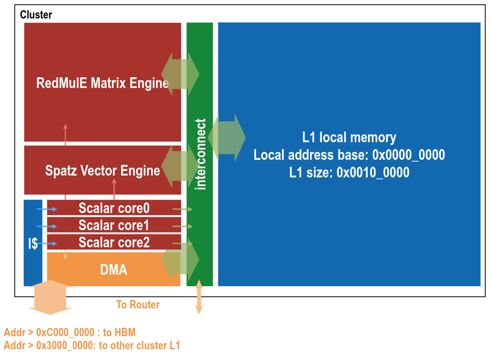

The `cluster_tcdm_base` and `cluster_tcdm_size` define the Cluster L1 addressing, which **every** cluster uses in the range `{cluster_tcdm_base, cluster_tcdm_base + cluster_tcdm_size}`. This applies to the Snitch core, Spatz engine, RedMulE engine, and iDMA.

In `soft_hier/flex_cluster_sdk/runtime/include/flex_runtime.h`, we provide the macro `local(offset)` to refer to local L1 addressing.

The `num_core_per_cluster` defines the number of Snitch cores per cluster. You can use the function `uint32_t flex_get_core_id()` to get the core ID within a cluster.

### Clusters in a Mesh 🌐

The `num_cluster_x` and `num_cluster_y` define the mesh shape. The cluster indexing is shown in the figure below.

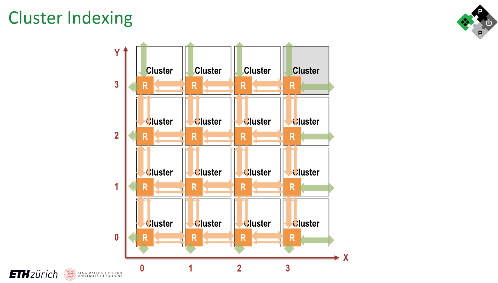

In `soft_hier/flex_cluster_sdk/runtime/include/flex_runtime.h`, the function `uint32_t flex_get_cluster_id()` is used to get the cluster ID, calculated as `x + y * num_cluster_x`. A `pos` structure is used to represent cluster coordinates. Related functions are:

```C
typedef struct FlexPosition {
    uint32_t x;
    uint32_t y;
} FlexPosition;

FlexPosition get_pos(uint32_t cluster_id) {
    FlexPosition pos;
    pos.x = cluster_id % ARCH_NUM_CLUSTER_X;
    pos.y = cluster_id / ARCH_NUM_CLUSTER_X;
    return pos;
}

// Methods to get adjacent positions
FlexPosition right_pos(FlexPosition pos) {
    uint32_t new_x = (pos.x + 1) % ARCH_NUM_CLUSTER_X;
    uint32_t new_y = pos.y;
    FlexPosition new_pos = {new_x, new_y};
    return new_pos;
}

FlexPosition left_pos(FlexPosition pos) {
    uint32_t new_x = (pos.x + ARCH_NUM_CLUSTER_X - 1) % ARCH_NUM_CLUSTER_X;
    uint32_t new_y = pos.y;
    FlexPosition new_pos = {new_x, new_y};
    return new_pos;
}

FlexPosition top_pos(FlexPosition pos) {
    uint32_t new_x = pos.x;
    uint32_t new_y = (pos.y + 1) % ARCH_NUM_CLUSTER_Y;
    FlexPosition new_pos = {new_x, new_y};
    return new_pos;
}

FlexPosition bottom_pos(FlexPosition pos) {
    uint32_t new_x = pos.x;
    uint32_t new_y = (pos.y + ARCH_NUM_CLUSTER_Y - 1) % ARCH_NUM_CLUSTER_Y;
    FlexPosition new_pos = {new_x, new_y};
    return new_pos;
}
```

`cluster_tcdm_remote` is used by iDMA to access the remote cluster's L1. For example, to access the L1 of a remote Cluster (x, y), the address range for iDMA is `{cluster_tcdm_remote + (x + y * num_cluster_x) * cluster_tcdm_size, cluster_tcdm_remote + (x + y * num_cluster_x + 1) * cluster_tcdm_size}`.

We provide several macros in `soft_hier/flex_cluster_sdk/runtime/include/flex_runtime.h` for remote addressing:
- `remote_cid(cid, offset)`
- `remote_xy(x, y, offset)`
- `remote_pos(pos, offset)`


### Cluster Local and Global Synchronization 🚀

We provide several APIs for local and global synchronizations in `soft_hier/flex_cluster_sdk/runtime/include/flex_runtime.h`
#### Intra-Cluster Synchronization  
To synchronize cores within a **single cluster**, use:  `flex_intra_cluster_sync()` .

#### Global Cluster Synchronization  
For synchronizing **all clusters**, we use an **XY cluster synchronization strategy**. The following APIs are provided:  

- `flex_barrier_xy_init()`. Initialize Global Barrier, Call **once at the beginning** of the program. No further calls are needed.  
- `flex_global_barrier_xy()` : Synchronizes all clusters using an **XY strategy** with **semi-hardware support** (recommended).  
- `flex_global_barrier_xy_polling()`: Synchronizes all clusters using an **XY strategy** with a **pure software-based polling approach**.  


### HBM Addressing 💾

For easier programming, the HBM address mapping is decoupled from the actual HBM placement. The address mapping is only related to the mesh shape.

The nodes at the mesh edges are named `{west, north, east, south}`, and their indexing is shown in the figure below. Each node is assigned a specific address range for HBM access.


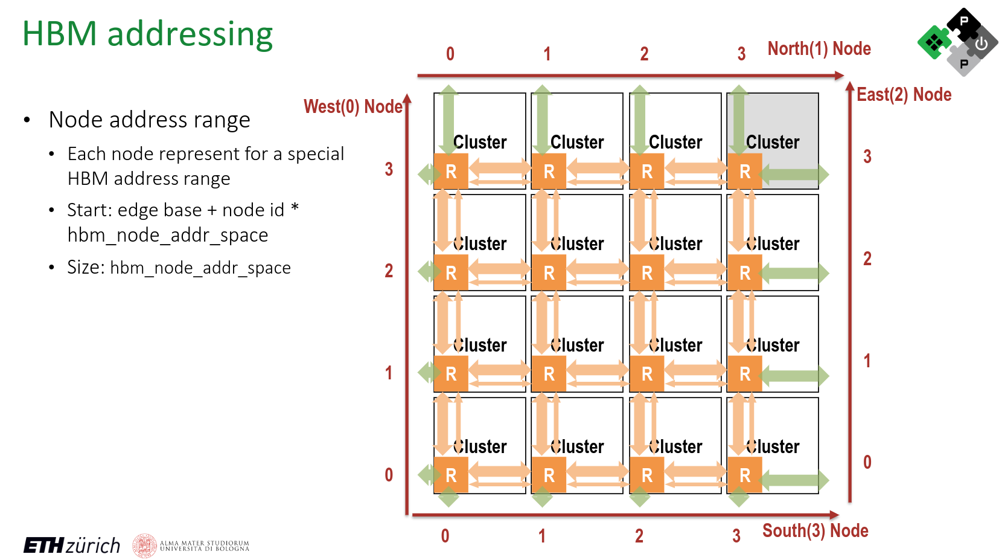

In `soft_hier/flex_cluster_sdk/runtime/include/flex_runtime.h`, we provide macros for HBM addressing:
- `hbm_addr(offset)` for addresses with an offset to global HBM space.
- `hbm_west(nid, offset)`
- `hbm_north(nid, offset)`
- `hbm_east(nid, offset)`
- `hbm_south(nid, offset)`

These macros allow for addressing within each node on different edges, with `nid` representing the node ID and `offset` representing the address within the node's edge.

### HBM Placement 🧩

SoftHier provides flexibility in defining how HBM channels and controllers are placed around the cluster mesh. Some edges may not have HBM connected, so attempting to access these "No HBM node address spaces" would be invalid.

The `hbm_chan_placement` list defines how many HBM channels are placed on `{west, north, east, south}` edges. The `num_node_per_ctrl` defines how many nodes share one controller. These numbers generally need to be powers of 2. If there are HBM channels on an edge, the number of channels should be greater than or equal to the number of controllers on that edge.

The figures below show possible and invalid HBM placement configurations.

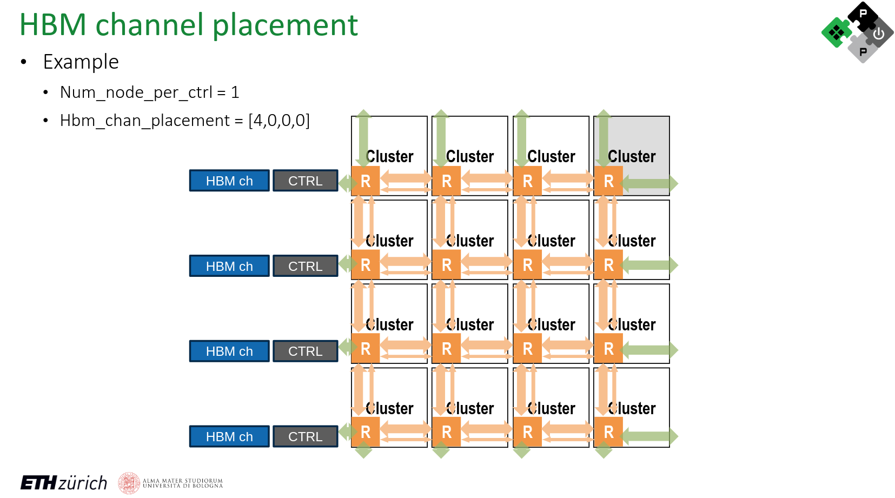
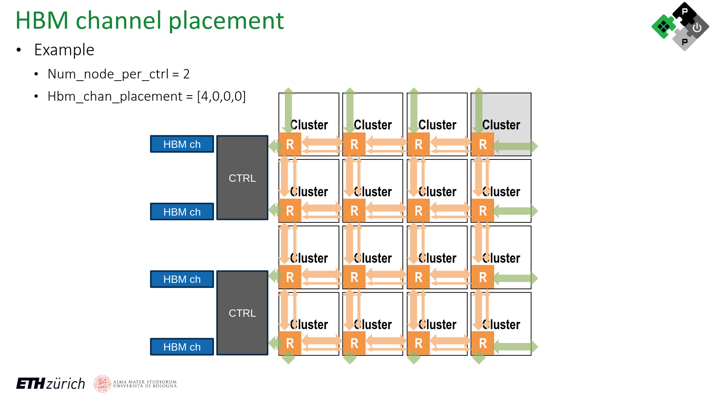
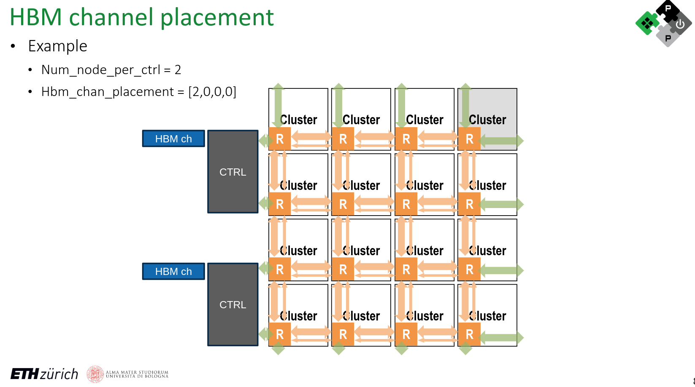
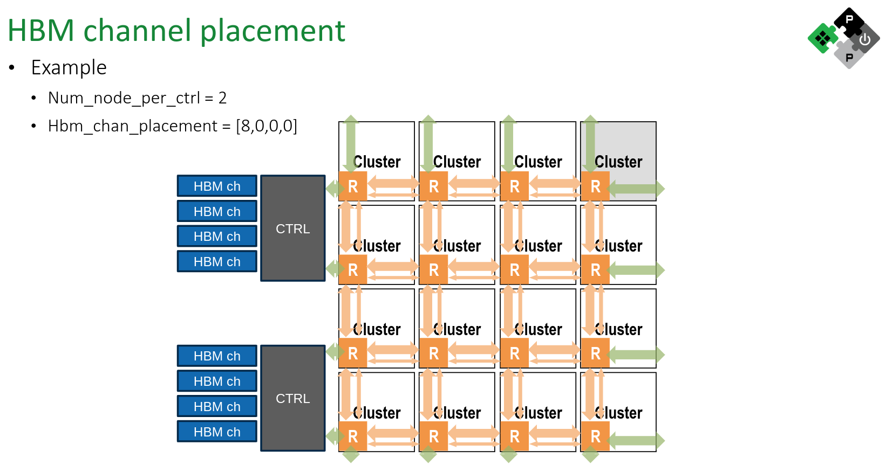
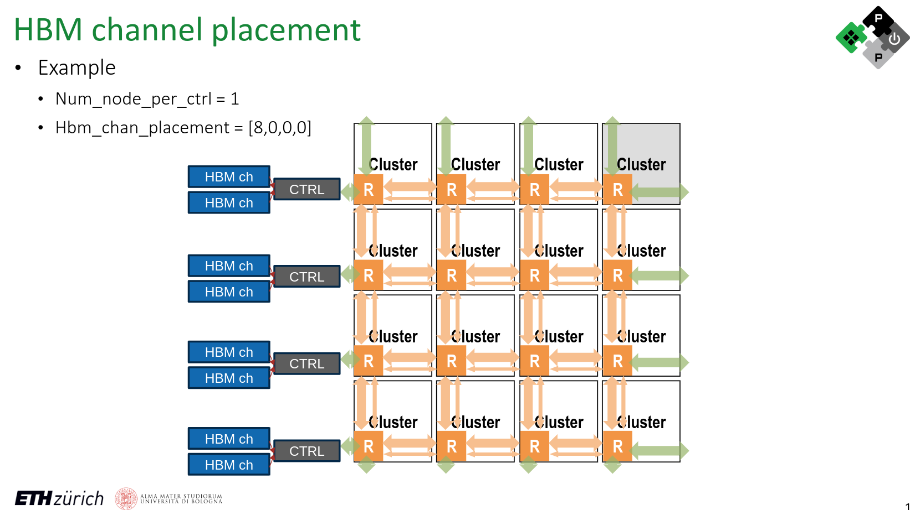
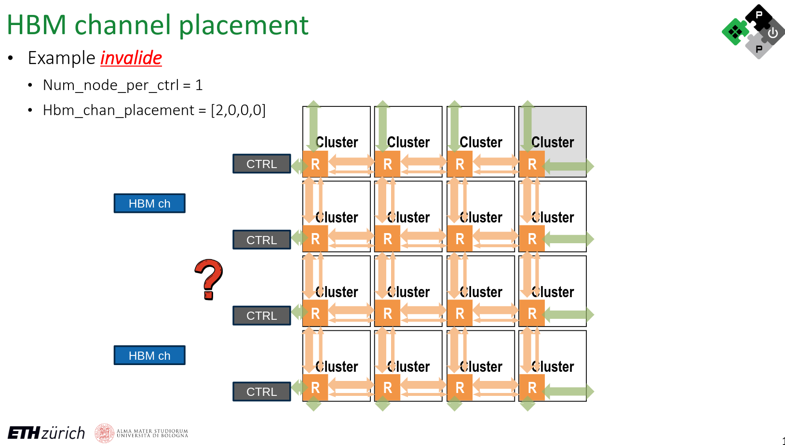
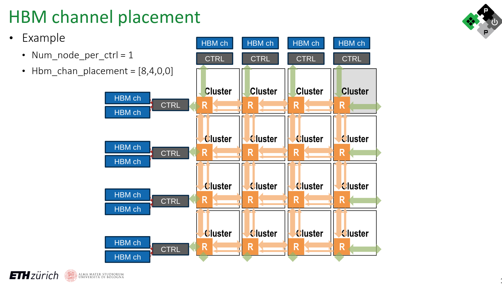
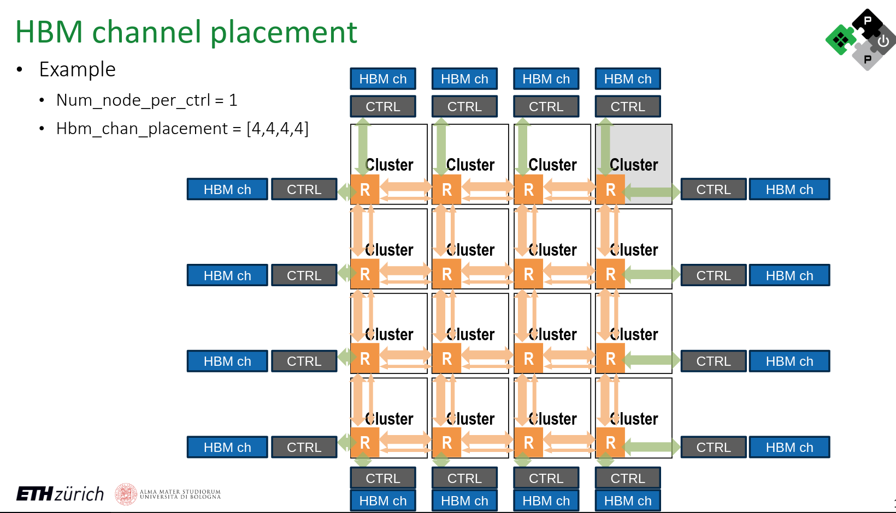
